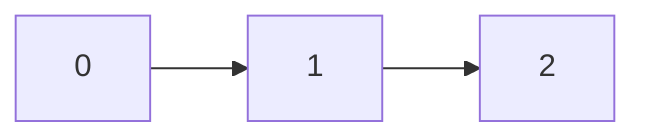
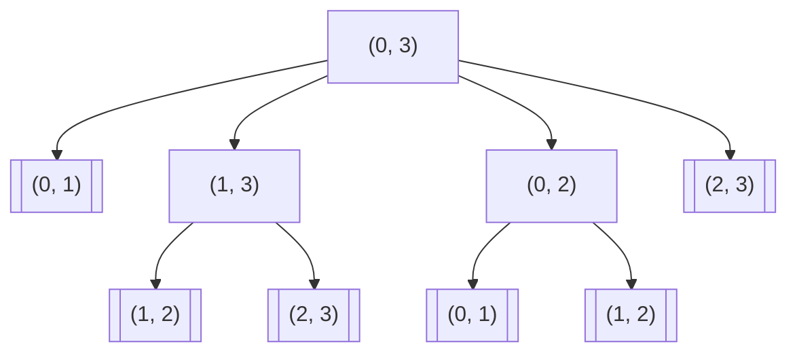
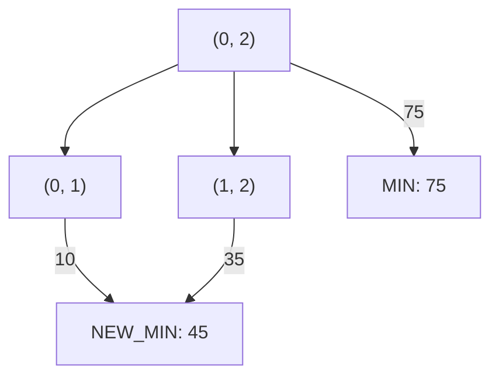

# 최저비용을 찾아 2차원 배열을 돌아다니기

<a href="https://unsplash.com/photos/DmDYX_ltI48">이미지출처</a>
## index 
--- 
- [최저비용을 찾아 2차원 배열을 돌아다니기](#최저비용을-찾아-2차원-배열을-돌아다니기)
  - [index](#index)
  - [문제: 역과 역 사이의 최소 비용 구하기](#문제-역과-역-사이의-최소-비용-구하기)
  - [풀이](#풀이)
  - [recap](#recap)

<br>
<br>
<br> 
## 문제: 역과 역 사이의 최소 비용 구하기
--- 
한 기차 노선 위에 0부터 N-1까지 N개의 역이 있습니다.

- 기차는 첫 번째 역(0번 부터 시작)부터 마지막 역(N-1)까지 한 방향으로만 이동합니다.
- 모든 두 역 사이의 기차 요금을 알고 있습니다.
  
0번 역에서 출발하여 N-1번 역까지 이동하는 최소 비용을 구하시오.

```js
// js
// 입력

const COST = [
  [0, 10, 75, 94],
  [-1, 0, 35, 50],
  [-1, -1, 0, 80],
  [-1, -1, -1, 0],
];
```

- `COST[0][0]`의 경우 값이 0입니다 이는 0번 역에서 0번 역으로 이동하는 비용을 나타냅니다. 

- `COST[0][1]`의 경우 0번 역에서 1번 역으로 이동하는데 발생하는 비용을 나타냅니다. 
- `COST[0][2]`의 경우 0번 역에서 2번 역으로 이동하는데 발생하는 비용을 나타냅니다.

> 0번 역에서 2번 역까지 한번에 이동하는 경우 75라는 비용이 발생합니다.

> 0번 역에서 1번 역으로 가는 비용은 10이므로 1번 역으로 이동한 다음 1번 역에서 
35의 비용을 지불하고 2번 역까지 이동하는 편이 더 저렴합니다.

이런식으로 N-1번 역까지 최저비용으로 이동하는 비용을 찾으면 됩니다.
<br>
<br>

## 풀이 
--- 

```js
const COST = [
  [0, 10, 75, 94],
  [-1, 0, 35, 50],
  [-1, -1, 0, 80],
  [-1, -1, -1, 0],
];

/**
 *
 * @param {number} s
 * @param {number} d
 */
const minCost = (s, d) => {
  if (s === d || s === d - 1) return COST[s][d]; // (base case)

  let minValue = COST[s][d]; // (1)
  for (let i = s + 1 /** (2) */; i < d; i++) {
    const temp = minCost(s, i) + minCost(i, d); 

    if (temp < minValue) minValue = temp;
  }

  return minValue;
};

const main = (() => {
  const result = minCost(0, 2); // 45
  console.log("result: ", result);
})();
```

이전에도 이런 비슷한 문제를 풀어본 적이 있습니다.


바로 [동전 교환 문제](https://zerozoo-a.github.io/algorithm/2022/11/28/coin-change-problem.html)가 위 문제와 비슷합니다.


위와 같은 문제들에서 중요한 점은 

1. 이전 값들을 재활용 할 수 있는 DP문제라는 것을 파악하는 것과
2. DP문제임을 알았다면 그에 맞는 식을 만들어내는 것
입니다. 

그런데 둘 다 쉽지 않죠 😇

1번이 맞는 이유는 예를 들어 서울에서 부산까지 기차를 타고 이동하는데
꼭 대구를 거쳐야 한다고 합시다.

서울에서 대구까지 최소비용으로 이동하는 값에 대구에서 부산까지 최소비용으로 이동하는 값을 더하면 항상 최소비용일 것입니다.

위처럼 문제를 해결해보고 싶네요

문제에서는 0번째 역에서부터 출발하는 것이 확정 사항입니다.

따라서 0번째 역에서부터 2번째 역까지 이동한다고 치면 총 2개의 역을 지나야합니다.


그런데 0번째 역에서 2번째 역까지 직통으로 이동하는 비용이 75이고
1번 역에서 갈아타 2번역까지 이동하는 비용이 총 45라고 합시다.

그럼 0번째 역에서 2번째 역까지의 최소비용은 45입니다.

이를 어떻게 식으로 만들 수 있을까요?

우선,
1. 0번째 역에서 2번째 역까지 바로 가는 비용을 알아야합니다. (75임을 알아야 하므로)
2. 0번째 역에서 그 다음역인 1번째 역까지 이동하는데 비용을 알아야겠습니다. (더 저렴한 방법을 찾아야 하므로)

위 두가지를 찾는 것이 아래의 코드입니다.

```js
let minValue = COST[s][d]; // (1)
```
```js
const temp   = 
               minCost(s, i) /** (2) */
               + minCost(i, d); /** (3) */
```
그런데 3번은 뭘까요? i, d를 인자로 받는 것을 보면 1번째 역에서 바로 2번째 역까지 이동하는 비용을 계산합니다.

이는 1번째 역에서 2번째 역까지만 찾으면 반복문을 종료해야 하므로 종료 조건을 발동시킵니다.

0번째에서 2번째까지 바로 가는 비용과 1번 역에서 환승하는 비용을 모두 구했습니다.

이제 둘 중 더 낮은 값을 선택하면 됩니다.


## recap 
--- 

기본적으로는 무작위 탐색이지만
`minCost(0, 3)`의 탐색을 시도한 경우 아래와 같이 탐색을 시작합니다.


얼추 보아도 중복 계산이 많습니다.

문제를 좀 단순하게 바라보기 위해 인자를 바꿔보겠습니다.


위 과정에서 `NEW_MIN`은 `MIN`을 대체하고,
1. 재귀가 종료되고
2. 반복문이 종료되고
3. MIN을 반환하면서 함수가 종료되고

함수는 종료됩니다.


`s번 역에서 i번 역까지의 최소 요금, i번 역에서 d까지 바로 가는 요금`
둘의 합과 이전에 계산 해놓은 minCost를 비교해 더 적은 값을 취합니다.


<br>
<br>


<br>
<br>
