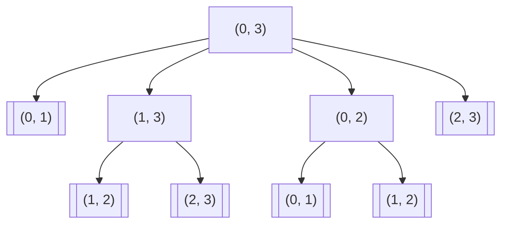
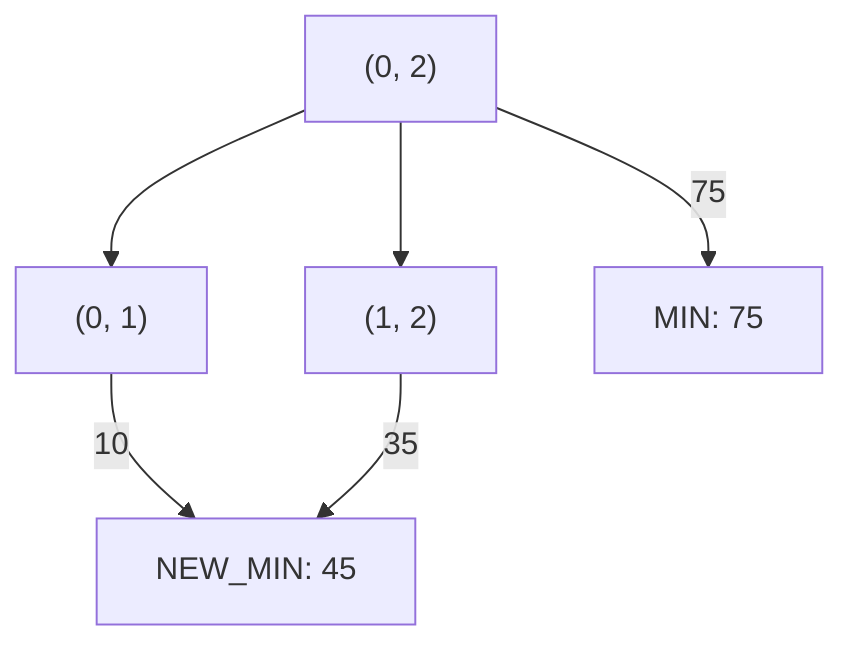

# 최저비용을 찾아 2차원 배열을 돌아다니기

<a href="https://unsplash.com/photos/DmDYX_ltI48">이미지출처</a>
## index 
--- 
- [최저비용을 찾아 2차원 배열을 돌아다니기](#최저비용을-찾아-2차원-배열을-돌아다니기)
  - [index](#index)
  - [문제: 역과 역 사이의 최소 비용 구하기](#문제-역과-역-사이의-최소-비용-구하기)
  - [풀이](#풀이)
  - [recap](#recap)

<br>
<br>
<br> 
## 문제: 역과 역 사이의 최소 비용 구하기
--- 
한 기차 노선 위에 0부터 N-1까지 N개의 역이 있습니다.

- 기차는 첫 번째 역(0번 부터 시작)부터 마지막 역(N-1)까지 한 방향으로만 이동합니다.
- 모든 두 역 사이의 기차 요금을 알고 있습니다.
  
0번 역에서 출발하여 N-1번 역까지 이동하는 최소 비용을 구하시오.

```js
// js
// 입력

const COST = [
  [0, 10, 75, 94],
  [-1, 0, 35, 50],
  [-1, -1, 0, 80],
  [-1, -1, -1, 0],
];
```

- `COST[0][0]`의 경우 값이 0입니다 이는 0번 역에서 0번 역으로 이동하는 비용을 나타냅니다. 

- `COST[0][1]`의 경우 0번 역에서 1번 역으로 이동하는데 발생하는 비용을 나타냅니다. 
- `COST[0][2]`의 경우 0번 역에서 2번 역으로 이동하는데 발생하는 비용을 나타냅니다.

> 0번 역에서 2번 역까지 한번에 이동하는 경우 75라는 비용이 발생합니다.

> 0번 역에서 1번 역으로 가는 비용은 10이므로 1번 역으로 이동한 다음 1번 역에서 
35의 비용을 지불하고 2번 역까지 이동하는 편이 더 저렴합니다.

이런식으로 N-1번 역까지 최저비용으로 이동하는 비용을 찾으면 됩니다.

<br>
<br>

## 풀이 
--- 

```js
const COST = [
  [0, 10, 75, 94],
  [-1, 0, 35, 50],
  [-1, -1, 0, 80],
  [-1, -1, -1, 0],
];

/**
 *
 * @param {number} s
 * @param {number} d
 */
const minCost = (s, d) => {
  if (s === d || s === d - 1) return COST[s][d]; // (base case)

  let minValue = COST[s][d]; // (1)
  for (let i = s + 1 /** (2) */; i < d; i++) {
    const temp = minCost(s, i) + minCost(i, d); 

    if (temp < minValue) minValue = temp;
  }

  return minValue;
};

const main = (() => {
  const result = minCost(0, 2); // 45
  console.log("result: ", result);
})();
```

이전에도 이런 비슷한 문제를 풀어본 적이 있습니다.

바로 [동전 교환 문제](https://zerozoo-a.github.io/algorithm/2022/11/28/coin-change-problem.html)가 위 문제와 비슷합니다.

반복문 내부에서 재귀를 하는 방식과 min 값을 높은 값에서 점점 낮은 값으로 내려가는 방식은 모두 동일합니다.

중요해보이는 것은 괄호로 표시해두었습니다.

우선 `base case`는 잠시 미루어두고


>`(1)`을 먼저 살펴보고 싶습니다.
<br>
<br>
`minValue`를 `COST[s][d]`로 정의하였습니다.
<br>
<br>
이 이유는 0번째 역에서부터 출발하는 이 문제의 특성을 잘 활용하였는데요
0번째 역에서 N-1번째 역까지 바로 가는 직행은 가장 가격이 높게 측정됩니다.
<br>
<br>
따라서 minCost가 되기 어려운데요 만약 찾아가는 역이 1번째 역이라면 그게 바로 minCost로써 조건을 달성하고 끝나겠지만
<br>
<br>
2번째 역이라고 한다면 `minCost`가 될 수 없는 구조입니다.
<br>
<br>
> 따라서 선택 가능한 선택지중 가장 높은 값을 자동적으로 `minValue`값으로 지정해놓고 시작하게 됩니다.

> `(2)` `i = s + 1`
> 위 코드가 의미하는 것도 재미있는데요.
>
> 위 코드는 시작 역을 뜻하는 s에 + 1을 합니다. 기본 값이 0이므로 
> 처음에는 0 + 1이 되어 i는 1로 초기화 되겠습니다.
>
> 이 때 i=1이면 반복문 내부에서는 `minCost(s, i)`를 넣게 됩니다.
>
> 아시겠지만 이는 재귀호출을 시작하게 하고 기저 조건까지 반복됩니다.
> 첫 호출된 재귀호출은 다시 minValue를 정하게 되는데
> `minValue = COST[s][i]`로 정의됩니다. 이는 `minValue = COST[0][1]`을 뜻하므로 0번째 역의 1번째 역으로가는 비용을 가리킵니다.

첫 재귀호출인 `minCost(s, i)`를 시작하면 `minCost(0, 1)`을 인자로 함수를 호출하게 됩니다.

이 때 바로 기저조건에 닿게 됩니다.

> 1. 기저조건은 출발역과 도착역이 같아진 경우
2. 도착역이 출발역 바로 다음 역인 경우
입니다.

 반환값으로는
`COST[0][1]`를 반환받습니다. 이는 10이므로 10을 반환받습니다.


그 후, `minCost(i, d)`를 실행하게 됩니다.
이는 `minCost(1, 2)`를 호출 한 것입니다.

이제 슬슬 윤곽이 조금씩 보입니다.

- `minCost(0, 1)`은 0번째 역에서 1번째 역으로 가는 비용을 반환 받습니다.

- `minCost(1, 2)`는 1번째 역에서 2번째 역으로 가는 비용을 반환 받습니다.

위 두가지 명제를 조금만 변형하면


- `minCost(0, 1)`은 `N번째` 역에서 `N+1번`째 역으로 가는 비용을 반환 받습니다.

- `minCost(1, 2)`는 `N+1번째` 역에서 `d번`째 역으로 가는 비용을 반환 받습니다.

이 둘을 더하고 `minValue`와 값을 비교하여 적은 쪽을 `minValue`로 업데이트합니다.

위와 같은 경우에는 각각의 재귀호출에 대해 10, 35를 반환받아 더하고 처음 minValue로 정했던 75보다 적으므로 

1. 45를 minValue를 초기화하고,
2. 재귀가 종료되고
3. 반복문이 종료되고
4. minValue를 반환
하면서 함수가 종료됩니다.

`d`의 값이 증가함에 따라 memoization을 하지 않으면
중복되는 함수덕에 실행속도는 기하급수적으로 늘어나게 됩니다.


<br>
<br>

## recap 
--- 
반복문이 증가하면서 0번 역부터 N-1번 역까지 탐색합니다.

기본적으로는 무작위 탐색이지만
`minCost(0, 3)`의 탐색을 시도한 경우 아래와 같이 탐색을 시작합니다.


얼추 보아도 중복 계산이 많습니다.

문제를 좀 단순하게 바라보기 위해 인자를 바꿔보겠습니다.


위 과정에서 `NEW_MIN`은 `MIN`을 대체하고,
1. 재귀가 종료되고
2. 반복문이 종료되고
3. MIN을 반환하면서 함수가 종료되고

함수는 종료됩니다.


>case 1
> ---
>1번 역에서 d번 역까지 가는데 필요한 최소 경비는
> - 1번역에서 d번 역까지 직행을 타는 방법
> - 2번 역에서 갈아타는 방법이 있습니다.

>case 2
> ---
>2번 역에서 d번 역까지 가는데 필요한 최소 경비는
> - 2번역에서 d번 역까지 직행을 타는 방법과
> - 3번 역에서 갈아타는 방법이 있습니다.

...

>case d-1
> ---
> - d-1번 역에서 d번 역까지 가는데 필요한 최소 경비는
> - d-1번역에서 d번 역까지 직행을 타는 방법이 있습니다.

따라서 n < d 일 때, d번 역까지 반복문을 돌면서 
반복문이 종료되는 시점까지 min 값을 전철을 갈아타면서 가는 비용과
min 값을 비교하여 최종적으로 더 적은 값을 반환한다.

<br>
<br>
