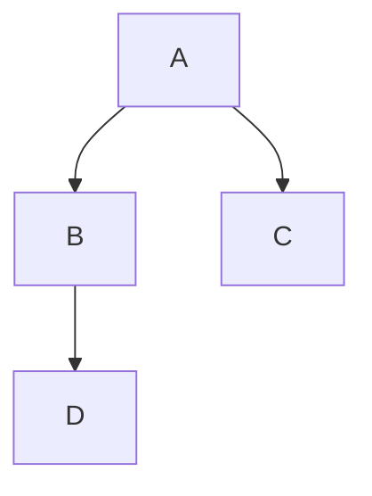
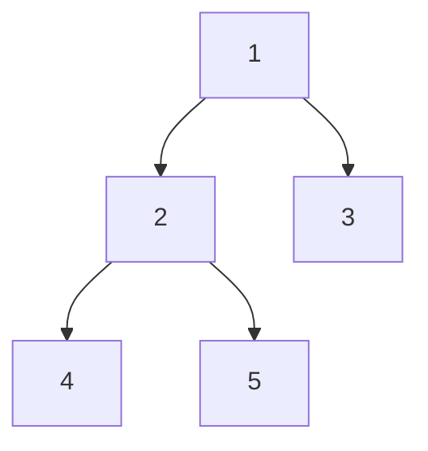

# tree의 기본: binary tree의 inOrder traverse




## index 
--- 
- [tree의 기본: binary tree의 inOrder traverse](#tree의-기본-binary-tree의-inorder-traverse)
  - [index](#index)
  - [문제](#문제)
  - [풀이](#풀이)
  - [recap](#recap)

<br>
<br>
<br>
 

## 문제 
--- 
binary tree의 inOrder traverse method를 구현하세요.
<br>
<br>


## 풀이 
--- 
문제를 해석하면 binary tree를 구현해야 할 것 같지만,
inOrder traverse만을 구현하면 됩니다.

binary tree 구조에 `[1, 2, 3, 4, 5]`를 순차적으로 집어넣을 경우
in order한 방식으로 순회하게 되면

`4, 2, 5, 1, 3`의 순서로 출력되게 됩니다.

이런 방식으로 출력되는 이유를 알기 위해선 두 가지를 알야아 합니다.
>   1. tree 구조
>  2. in order traverse 함수의 원리


1. tree 구조
---
입력: `[1, 2, 3, 4, 5]`에 대해 binary tree는 아래와 같은 구조를 가집니다.



in order는 재귀호출을 통해 보통 구현이 됩니다.
재귀호출은 이런 끝을 정확히 알기 어려운 구조를 탐색하는데 아주 최적화 되어 있습니다.

2. in order traverse 함수의 원리
---
> 중위 순회
>   1. 왼쪽 서브트리를 중위 순회한다.
>   2. 노드를 방문한다.
>   3. 오른쪽 서브 트리를 중위순회한다.

위 내용은 [이 곳](https://en.wikipedia.org/wiki/Tree_traversal#In-order,_LNR)
을 참고하였습니다.

재귀적으로 서브트리를 왼쪽에서 오른쪽으로 이동하며 방문하는게 중위 순회입니다. 
중위 순회가 뭔지 정확히 알았습니다. 이게 전부이고 더 뭔가 의미가 있지 않습니다. 

이를 어떻게 활용하여 어떤 문제를 해결할지를 직접 알아내야하는게 어려운 부분입니다. 😭

그럼 동작을 이해해보겠습니다.

> 1. 왼쪽 서브트리를 중위 순회한다.

`1, 2, 4`를 먼저 탐색하게 되겠네요.
재귀의 기저조건을 정해야 하는데 왼쪽 서브트리가 더 이상 존재하지 않는 것을 기준으로 삼아야므로
`기저조건은 도착한 노드에 데이터가 없는 경우입니다.`

이제 콜스택은 아래와 같은 방식으로 쌓였습니다.

| call stack |
| -- |
| null |
| 4 |
| 2 |
| 1 |

스택에 null이 들어왔네요, 기저조건에 도달한 상태입니다. 

> 2. 노드를 방문한다.

void를 반환하고 null이라는 스택은 터트려줍시다.
null이라는 스택은 이제 사라지고 

| call stack |
| -- |
| 4 |
| 2 |
| 1 |
현재 스택은 4에 있습니다. 
현재 왼쪽 서브트리의 끝임을 확인하였으므로 현재 노드의 값 4를 출력해줍니다.

> 3. 오른쪽 서브트리를 중위 순회한다.
현재 노드의 값을 출력하고 남은 일은 오른쪽 서브트리를 중위 순회하는 것입니다.
그리고 오른쪽 서브트리로 이동하면 됩니다.

이 부분은 스택 4에서 나머지 연산을 처리하는 부분입니다. 4에 대한 콜 스택이 해제 되기 전에
오른쪽 서브트리에 대한 스택을 쌓게 됩니다.


| call stack |
| -- |
| 오른쪽 subtree |
| 4 |
| 2 |
| 1 |

오른쪽 subtree가 모두 실행되고 나서 stack 4로 돌아왔을 때, 4를 다시 출력하지는 않습니다.
4를 출력하는 부분은 이미 지나갔다는 것을 컴퓨터는 그 당시의 컨텍스트를 기억하고 있기 때문입니다.


<br>

위와 같은 재귀를 반복하다가 오른쪽 subtree마저 모두 돌고 root의 스택까지 돌아왔을때 재귀는 종료됩니다.
그러면 in order 순회를 마치게 됩니다.
<a href="https://zerozoo-a.github.io/algorithm/2022/12/07/traverse-with-recursion.html">
이전 글에서</a> 설명한 것과 연계되는 내용이 많습니다. 

구현은 아래와 같습니다.

```js
// node.js
class Node {
  constructor(val) {
    this.data = val;
    this.left = this.right = null;
  }
}
/**
 * @param {Node} node
 *
 */
const printInOrder = (node) => {
  if (!node) return;

  printInOrder(node.left);
  console.log(node.data);
  printInOrder(node.right);
};

const main = (() => {
  const root = new Node(1);
  root.left = new Node(2);
  root.right = new Node(3);
  root.left.left = new Node(4);
  root.left.right = new Node(5);

  printInOrder(root);
  console.log(`InOrder traversal of binary tree \n`);
  return 0;
})();

```

```cpp
#include<iostream>

struct Node {
    int data;
    struct Node *left, *right;
};

Node* newNode(int data) {
    Node* temp = new Node;
    temp->data = data;
    temp->left = temp->right = NULL;
    return temp;
}

void printInOrder(struct Node* node) {
    if(node == NULL) return;

    printInOrder(node -> left);
    std::cout << node -> data << " ";
    printInOrder(node -> right);
}

int main() {
    struct Node* root = newNode(1);
    root->left = newNode(2);
    root->right = newNode(3);
    root->left->left = newNode(4);
    root->left->right = newNode(5);


    std::cout << "\n InOrder traversal of binary tree is \n";
    printInOrder(root);
    return 0;
}
```


<br>
<br>

## recap 
--- 
in order traverse는 한국어로는 중위순회라는 이름을 가집니다.

> 중위 순회(Inorder)는 다음의 순서로 진행된다.
1. 왼쪽 서브 트리를 중위 순회한다.
2. 노드를 방문한다.
3. 오른쪽 서브 트리를 중위 순회한다.

중위 순회는 대칭 순회(symmetric)라고도 한다. [출처](https://ko.wikipedia.org/wiki/%ED%8A%B8%EB%A6%AC_%EC%88%9C%ED%9A%8C)

대칭 순회라는 말이 더 적합한 것 같은데요 위키에도 그냥 중위순회 (inorder)라고 적혀있습니다.

의문인게 inorder를 무질서로 봐야할지, in-order 질서로 봐야할지 모르겠다는겁니다.
<br>

inorder, in-order가 무작위하게 사용되고 있어서 더 혼란스러운데요.
<br>

그냥 대칭 순회라는게 더 적합한 것 같아 그렇게 이해하기로 했습니다.


또한 위의 구현은 인위적으로 트리의 구조를 넣어주었는데요.

<br>
이를 코드로 구현하는 방법이야 당연히 있지만 이를 구현하는데는 시간이 오래걸리기도 하고,
목적인 중위 순회를 알아보는 것과는 관련이 없다 판단하여 생략하였습니다.

<br>
<br>


