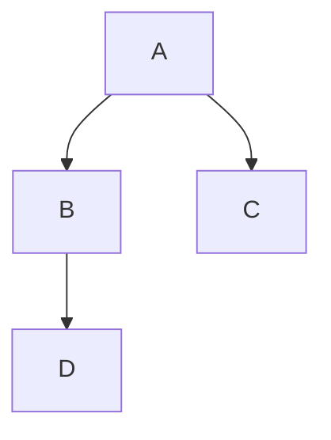
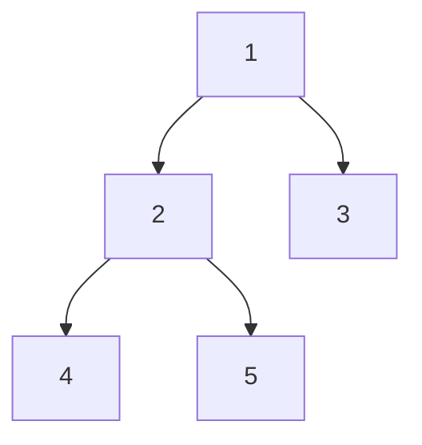

# tree의 기본: binary tree의 inOrder traverse




## index 
--- 
- [tree의 기본: binary tree의 inOrder traverse](#tree의-기본-binary-tree의-inorder-traverse)
  - [index](#index)
  - [문제](#문제)
  - [풀이](#풀이)
  - [recap](#recap)

<br>
<br>
<br>
 

## 문제 
--- 
binary tree의 inOrder traverse method를 구현하세요.
<br>
<br>


## 풀이 
--- 
문제를 해석하면 binary tree를 구현해야 할 것 같지만,
inOrder traverse만을 구현하면 됩니다.

binary tree 구조에 `[1, 2, 3, 4, 5]`를 순차적으로 집어넣을 경우
in order한 방식으로 순회하게 되면

`4, 2, 5, 1, 3`의 순서로 출력되게 됩니다.

이런 방식으로 출력되는 이유를 알기 위해선 두 가지를 알야아 합니다.
>   1. tree 구조
>  2. in order traverse 함수의 원리


1. tree 구조
---
입력: `[1, 2, 3, 4, 5]`에 대해 binary tree는 아래와 같은 구조를 가집니다.



in order는 재귀호출을 통해 보통 구현이 됩니다.
재귀호출은 이런 끝을 정확히 알기 어려운 구조를 탐색하는데 아주 최적화 되어 있습니다.

in order 함수는 재귀적으로 root 노드에서부터 왼쪽의 자식 노드만을 먼저 재귀적으로 순회합니다.

`1, 2, 4`를 먼저 탐색하게 되겠네요.

`기저조건은 도착한 노드에 데이터가 없는 경우입니다.`

이제 콜스택은 아래와 같은 방식으로 쌓였습니다.

| call stack |
| -- |
| null |
| 4 |
| 2 |
| 1 |

스택에 null이 들어왔네요, 기저조건에 도달한 상태입니다. void를 반환하고 null이라는 스택은 터트려줍시다.


이제 4를 출력하고 4의 스택에서 해야 할 남은 일들을 처리해줍니다. 바로 해당 노드의 오른쪽을 순회하는 것입니다.

함수에 오른쪽 노드를 넣어주면 됩니다.

| call stack |
| -- |
| 4 |
| 2 |
| 1 |

<br>

그럼 스택은 아래와 같이 쌓입니다. 다시 기저조건에 닿게 되고 위와 같은 과정을 반복합니다.

그러면 in order 순회를 마치게 됩니다.
<a href="https://zerozoo-a.github.io/algorithm/2022/12/07/traverse-with-recursion.html">
이전 글에서</a> 설명한 것과 연계되는 내용이 많습니다. 

구현은 아래와 같습니다.

```js
// node.js
class Node {
  constructor(val) {
    this.data = val;
    this.left = this.right = null;
  }
}
/**
 * @param {Node} node
 *
 */
const printInOrder = (node) => {
  if (!node) return;

  printInOrder(node.left);
  console.log(node.data);
  printInOrder(node.right);
};

const main = (() => {
  const root = new Node(1);
  root.left = new Node(2);
  root.right = new Node(3);
  root.left.left = new Node(4);
  root.left.right = new Node(5);

  printInOrder(root);
  console.log(`InOrder traversal of binary tree \n`);
  return 0;
})();

```

```cpp
#include<iostream>

struct Node {
    int data;
    struct Node *left, *right;
};

Node* newNode(int data) {
    Node* temp = new Node;
    temp->data = data;
    temp->left = temp->right = NULL;
    return temp;
}

void printInOrder(struct Node* node) {
    if(node == NULL) return;

    printInOrder(node -> left);
    std::cout << node -> data << " ";
    printInOrder(node -> right);
}

int main() {
    struct Node* root = newNode(1);
    root->left = newNode(2);
    root->right = newNode(3);
    root->left->left = newNode(4);
    root->left->right = newNode(5);


    std::cout << "\n InOrder traversal of binary tree is \n";
    printInOrder(root);
    return 0;
}
```


<br>
<br>

## recap 
--- 
<br>
<br>

자료구조를 구현하는 것에 질려버렸거나 지레 겁먹지 말고, 구현할줄은 몰라도 해당 구조의 메소드 하나씩을 뜯어먹어보고 있습니다.

이러다 보면 다 뜯어먹는 날이 오지 않을까요?