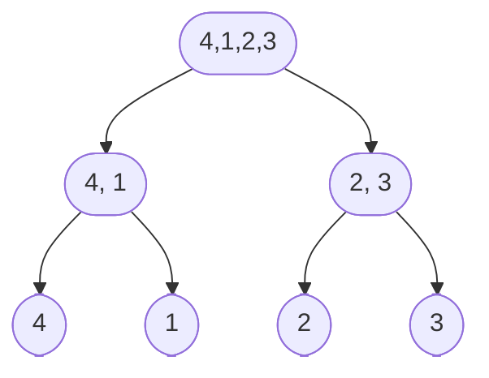

<sup>
	각주:[1](배너_이미지_출처)
</sup>
<br />
<br />
<br />

# 합병정렬(merge sort)란?

> 합병 정렬 또는 병합 정렬(영어: merge sort 머지 소트[*])은 O(n log n) 비교 기반 정렬 알고리즘이다. 일반적인 방법으로 구현했을 때 이 정렬은 안정 정렬에 속하며, 분할 정복 알고리즘의 하나이다. 존 폰 노이만이 1945년에 개발했다. 상향식 합병 정렬에 대한 자세한 설명과 분석은 1948년 초 헤르만 골드스타인과 폰 노이만의 보고서에 등장하였다. - 출처: wiki -

## 합병정렬의 흐름

합병정렬을 통해 배열을 정렬한다고 가정합니다.

합병정렬은 아래와 같은 순서로 진행됩니다.

- 배열을 원소 1개의 배열이 될 때까지 재귀적으로 분리합니다.
- 배열을 나누는 것은 n개의 배열의 경우 n개의 시간이 소요됩니다.
- 나뉘어진 배열은 재귀트리의 리프부분입니다. 
- 나뉘어진 배열을 정렬하며 합칩니다.
- 재귀로 인해 쌓여진 콜스택이 모두 해제되면 정렬된 배열이 만들어집니다.


위의 그래프를 기준으로 최하단의 [2], [3]을 비교해 정렬하고
새로운 배열([2, 3])을 만들어 반환합니다.

위 과정을 반복합니다.

## 예시코드

```js
function mergeSort(A) {
  if (A.length === 1) return A;

  const p = Math.floor(A.length / 2);
  const l = A.slice(0, p);
  const r = A.slice(p);
  return merge(mergeSort(l), mergeSort(r)); // mergeSort의 결과값은 다음 호출될 콜스택의 l과 r의 인자로 사용됩니다.
}

function merge(l, r) {
  const result = [];
  while (l.length > 0 && r.length > 0) {
    l[0] <= r[0] ? result.push(l.shift(0)) : result.push(r.shift(0)); // l, r 두 배열의 0번째 인자를 서로 비교하면서 result 배열에 담아줍니다.
	// shift로 비교가 끝난 배열의 0번째 인덱스를 지워주면 다음 순회에서도 두 배열을 비교할 수 있습니다.
  }
  return [...result, ...l, ...r]; // l과 r 배열은 인자가 남게 됩니다. 이를 destructuring해주어 정리해줍니다.
}

const r = mergeSort([4, 1, 2, 3]);
console.log(r) // [1, 2, 3, 4]
```

## n log n

n개의 인자를 가진 배열을 2로 x번 나누면 1개의 인자를 가진 배열이 되었습니다.

이는 $n/2^x$입니다.

반대로 1개의 인자를 가진 배열을 x번 두배하면 n개의 인자를 가진 하나의 배열이 될 것입니다.

이는 $1 * 2^x=n$ 이를 밑을 2로하는 로그로 나타내면
$x=log_2n$입니다.

4개의 인자를 가진 배열의 경우 $x=log_24 = 2$ 즉 재귀트리의 level은 2까지 자라나게 됩니다.


나머지 n은 무엇일까요?

보통 n은 순회를 찾으면 끝입니다.
위 코드에서 while문으로 순회하는 비교 및 재정렬이 n에 해당합니다.
(사실 shift로 배열을 조작하는 순간 배열의 인덱스를 재정립하기 위해,
 뒤에서 돌아가는 것들은 전부 무시한 상태입니다.)


## 정리

합병정렬의 코드, 흐름, 속도에 대해 알아봤습니다.

재귀를 이용해 우아하면서도 배울게 많은 정렬입니다.
긴 글 봐주셔서 감사합니다.