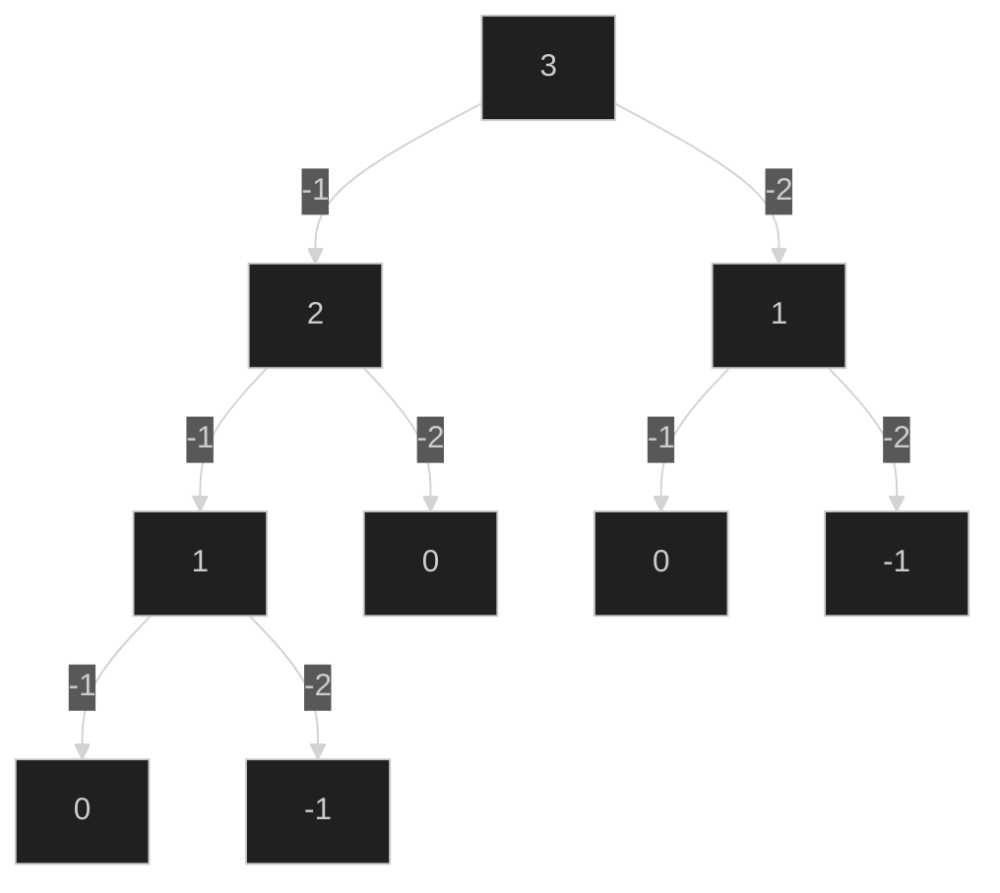
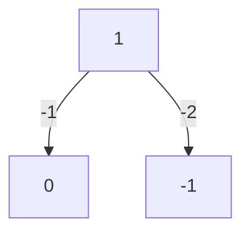

<br />
<br />
<br />

## 전개
가게에서 점원은 손님에게 거스름돈을 거슬러줘야 한다.
거스름돈은 동전으로 거슬러 줄 수 있다.

## 조건
- 거스름돈의 동전의 개수는 최소한이 되도록 거슬러 주어야 한다.
- 500, 100, 50, 10원 짜리 동전이 무수히 존재하고 N원을 거슬러 준다.
- n(거스름돈)은 항상 10의 배수이다.

## 예
1260원을 거슬러 준다면 500 + 500 + 100 + 100 + 50 + 10을 준다.
거스름돈이 1000원: (500 * 2)
거스름돈이 600원: (500 * 1, 100 * 1)
거스름돈이 300원: (100 * 3)


## 풀이 (JS)
나눗셈 연산에 대해 자바스크립트는 형변환이 확장되며 일어나기 때문에,
자연수에서 실수로 확장되어버린다. 따라서 적절한 방법으로 소수점을 처리해주어야 합니다.
```js
// js
let n = 543534430;
let count = 0;
const coins = [500, 100, 50, 10];

// 길게 풀어쓴 버전
for (coin of coins) {
    const 코인으로_거스름돈을_나눈_몫 = Math.floor(n / coin);
    count += 코인으로_거스름돈을_나눈_몫;
    const 코인으로_나눈_나머지 = n % coin;
    n = 코인으로_나눈_나머지
}

// 짧게 줄인 버전
for (coin of coins) {
    count += ~~(n / coin); 
    n %= coin;
}
console.log('거스름돈의 개수: ',count)
```


## 풀이 (JAVA)
자바에서는 int의 경우 소수점을 버리고
double의 경우 소수점을 살려줍니다. (좋네요)

```java
// java
package org.example;

public class Main {
    public static void main(String[] args) {
        int n = 543534430;
        int count = 0;
        int[] coins = {500, 100, 50, 10};

        for (int coin : coins) {
            count += (n / coin);
            n %= coin;
        }

        System.out.println("count: " + count);
    }
}
```

## 중요한 점

거스름 돈 문제에선 동전의 셋이 중요합니다.

동전이 500, 100, 50, 10 있을 때, 가장 큰 동전인 500원은 하위 동전의 배수입니다.
하위 동전 100, 50, 10은 아무리 조합해도 500원 하나의 개수보다 더 적은 최적해를 만들 어 낼 수 없습니다.

600원을 거슬러 준다고 했을 때, 500원을 안쓰고 100, 50, 10으로 500원 + 100원을 거슬러 주는 것 보다 더 나은 해를 구할 수 없습니다.

따라서 그리디하게 접근하는 것이 정당해집니다.

700원을 거슬러주는데 동전 셋이 [500원 400원 300원 100원] 이라고 합시다.
그리디하게 접근하는 경우 [500, 100, 100]으로 총 3개가 나옵니다.
정답은 [400, 300]으로 2개인데 말입니다.

조심해서 풀거나.. 혹은 dp등 다른 방법을 사용하는 것도 좋습니다.

아래는 DP를 활용한 방법입니다.

## 풀이 

```java
// java
package org.example;
import java.util.Arrays;

public class Main {
    public static void main(String[] args) {
        int[] coins = {500,100, 50, 10};
        int amount = 1240;
        int[] memo = new int[amount + 1];
        Arrays.fill(memo, -1);

        int res = changeCoin(coins, amount, memo);
        System.out.println("res: " + res);


    }

    public static int changeCoin(int[] coins, int amount, int[] memo) {
        if(amount < 0) return -1;
        if(amount == 0) return 0; // 딱 떨어지면 거스름돈을 정량으로 주었다는 뜻
        if(memo[amount] != -1) return memo[amount];

        double count = Double.POSITIVE_INFINITY;
        for(int coin : coins) {
            int subTreeResponse = changeCoin(coins, amount - coin, memo);
            if(subTreeResponse == -1) continue;

            count = Math.min(count, subTreeResponse + 1);
        }

        if(count != Double.POSITIVE_INFINITY) memo[amount] = (int) count;
        else memo[amount] = -1;

        return memo[amount];
    }
}
```


브라우저에서도 바로 테스트 할 수 있게끔 코드를 js로 작성해봤습니다.
```js
function main () {
    const coins = [500, 100, 50, 10];
    const amount = 1240;
    const memo = new Array(amount + 1).fill(-1);

    const result = changeCoin(coins, amount, memo);
    console.log("result: " + result); // 8
    
}

function changeCoin(coins, amount, memo) {
    if(amount < 0) return -1;
    if(amount === 0) return 0;
    if(memo[amount] !== -1) return memo[amount];

    let count = Infinity;

    for(coin of coins) {
        const subTreeResponse = changeCoin(coins, amount - coin, memo);
        if(subTreeResponse === -1) continue;
        count = Math.min(count, subTreeResponse + 1);
    }
    
    if(count !== Infinity) memo[amount] = count;
    else memo[amount] = -1;
    
    return memo[amount];
}
```

## dp 풀이 설명

이 잔돈문제의 dp 버전은

코인 배열을 순회하면서 내부적으로 재귀호출을 한다는 점입니다.
재귀호출을 하면서 총 거슬러 주어야 할 값인 amount - 현재 반복하고 있는 coin의 값으로
amount를 빼주면서 재귀 호출을 부릅니다.

500원을 거슬러 주고 코인셋은 100원, 50원, 10원이라 합시다.

```java
int[] coins = {100, 50, 10};
int amount = 500;
int recur(coins, amount) {
    for(int coin : coins) {
        recur(coins, amount - coin)
    }
}
```
위 코드처럼 재귀호출을 하게 되면 호출된 재귀에서의 amount는 (amount - 100)된 값이 됩니다.

다음 재귀에서도 coins는 loop는 새로 정의되어지므로 다시 100원부터 빼기 시작합니다.
즉 100원으로 거슬러 줄 수 있는 모든 경우의 수를 세어가는 과정이 됩니다.

이제 적당히 base case를 넣어주면 되는데요

amount를 지속적으로 빼주다가 값이 0이된 순간이 거스름 돈을 정확하게 거슬러준 경우입니다.
만약 0 미만인 경우 거스름 돈을 더 내어준 경우가 되므로 이는 -1로 반환해줍니다.

```java
int[] coins = {100, 50, 10};
int amount = 500;
int recur(coins, amount) {
    if(amount == 0) return 0;
    if(amount < 0) return -1;
    for(int coin : coins) {
        recur(coins, amount - coin)
    }
}
```

amount 값을 coin의 값으로 계속 빼주는 작업을 그림을 그리면서 이해하면
재귀트리가 된다는 사실을 알 수 있습니다.

```
amount: 3,
coins: {1, 2}
```
라고 정의한다면 위 함수대로라면 아래와 같은 개형이 만들어집니다.



함수가 시작되고 첫 반복문의 재귀 호출은,
위 트리의 가장 왼쪽 노드까지 향하는 과정을 표현 한 것입니다.

즉 이 방법은 cpu를 통해 모든 경우의 수를 모두 순회하는 방법입니다.

하지만 greedy로는 풀 수 없는 문제를 풀 수 있습니다.
위 방법을 조금 더 효율적으로 만들어 줄 memoization을 도입하면

서브트리의 중복 연산을 피할 수 있습니다.


고작 amount 3 을 거슬러주는 문제 풀이에서도 중복이 목격됩니다.

amount가 커지면 커질 수록 엄청난 중복이 발생 할 것을 쉽게 예측가능합니다.

