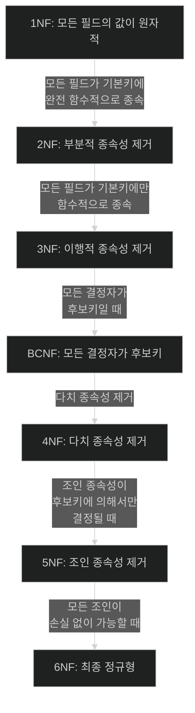

<br />
<br />
<br />

# 데이터 모델링에서 정규화에 대해 

DB 정규화는 데이터를 구조화하여 중복을 최소화하고
데이터 조작시 발생할 수 있는 오류와 데이터 중복을 방지합니다.

## 정규화의 의미

```md
정규화는 데이터의 중복과 
삽입(insertion), 삭제(deletion), 갱신(update)의 
이상현상(anomaly)을 방지(최소화)하기 위해
normal form을 수행하는 것을 말합니다.
```

### 정규화의 단계

- 정규화는 1NF, 2NF, 3NF, BCNF, 4NF, 5NF, 6NF 단계를 거칩니다.

- NF 단계는 테이블이 달성한 정규화 수준을 나타내는 척도입니다.

- NF는 테이블이 생성된 후 다음 NF를 순서대로 만족해야 합니다.
예를 들어 1NF에서 3NF로 바로 건너 뛸 수 없으며 3NF는 2NF를 만족해야 한다는 속성을 가집니다.

### 정규화의 특징

- NF는 normal form을 의미합니다.
- 특정 테이블이 정규화 되었다라고 하기 위해선 **최소 3NF는 만족**해야 합니다.
- 실무에선 3NF | BCNF까지만 진행하는 경우가 많습니다.
- 1NF 부터 BCNF까지는 <a href="/blog/Engineer-Information-Processing/Functional-Dependent-attribute/">FD = 함수적 종속성</a>와 key만으로 정의되는 NF입니다.

## 단계별 정규화

### 제 1 정규형

1. 모든 필드의 값이 <a href="/blog/Engineer-Information-Processing/Relational-database-atomicity/">원자적</a>이어야 합니다.
2. 각 레코드가 유일해야 합니다.
3. 테이블의 모든 컬럼은 중복되지 않고 단일 값을 가져야 합니다.

### 제 2 정규형

1. 1 NF를 만족합니다.
2. 모든 비주요 속성이 완전 함수적 종속을 이루어야 합니다.
  - 비주요 속성: 테이블의 기본키가 아닌 다른 모든 속성을 뜻합니다.
  - <a href="/blog/Engineer-Information-Processing/Functional-Dependent-attribute/">함수적 종속성</a>: 하나의 속성이 다른 속성에 의해 결정되는 관계를 뜻합니다.
3. 모든 비주요 속성이 기본키(PK)에만 의존합니다.

### 제 3 정규형

1. 2 NF를 만족합니다.
2. 모든 비주요 속성이 <a href="/blog/Engineer-Information-Processing/transitive-dependency/">이행적 종속성</a>을 갖지 않아야 합니다. (transitive-dependency)
3. 비주요 속성이 다른 비주요 속성을 의존하지 않아야 합니다.

### BCNF 정규형


