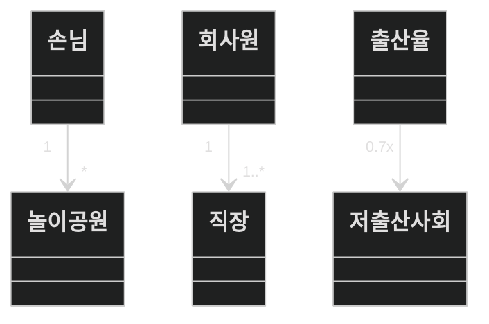

 
 
 

# class diagram 4 Cardinality

**Cardinality**란 수학용어로 집합에서 집합 내 원소의 개수 또는 크기를 나타내는 개념입니다.

class diagram에서는 이를 class간의 연결 할 수 있는 한 클래스의 인스턴스 수를 나타냅니다.

예를 들자면 회사에서 0명이 아닌 한 명 이상의 직원이 있고,
직원은 0개 또는 하나 이상의 회사에서 근무합니다.

Cardinality는 연결의 끝 부분에 표시됩니다.

이로써 간단하게 cardinality에 대해 알아봤습니다.

