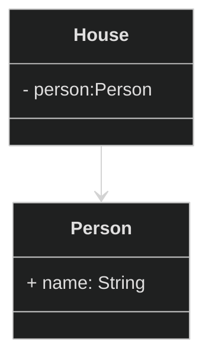
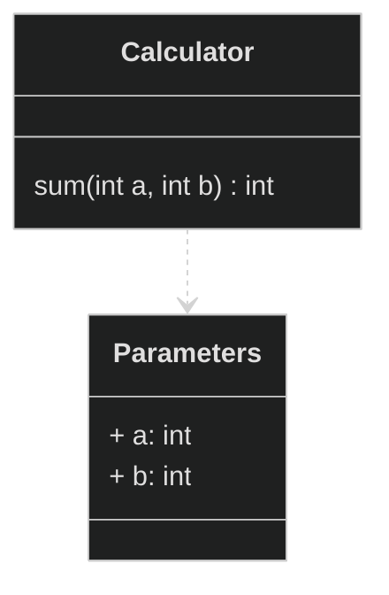
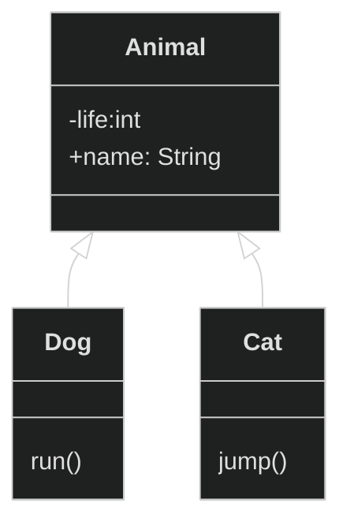
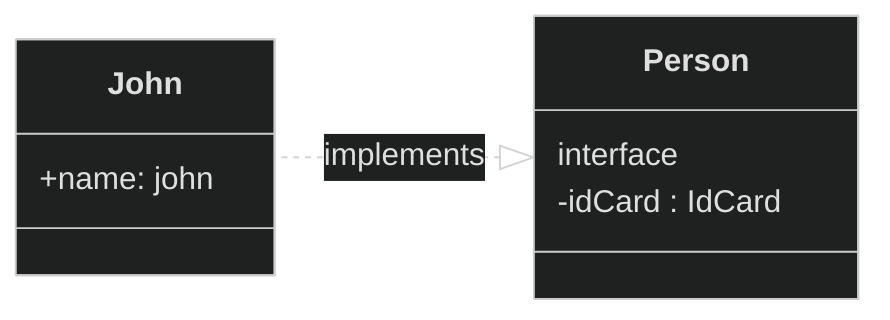
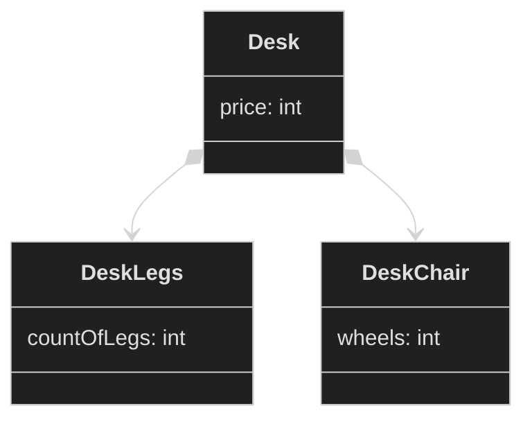
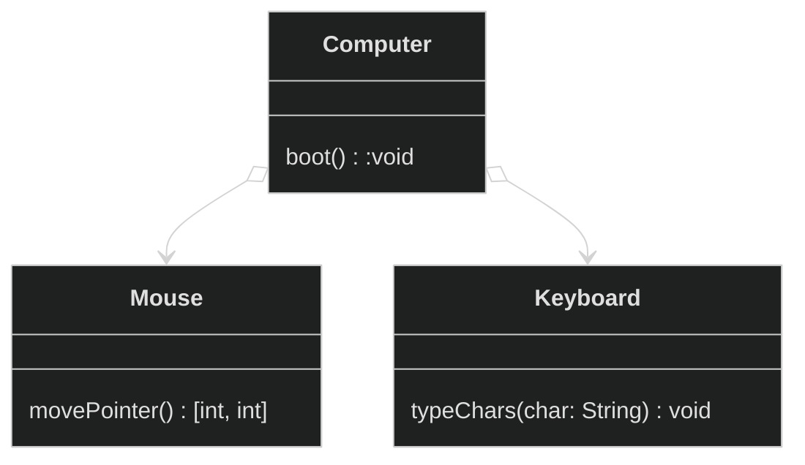

 
 
 

# 관계들

- 관계들
    - 연관관계: Association
    - 의존관계: Dependency
    - 일반화관계: Generalization
    - 실체화관계: Realization
    - 포함/합성관계: Composition
    - 집합/집약 관계: Aggregation

- 확장 스테레오 타입들 
    - `<<include>>`
    - `<<extend>>`
    - `<<interface>>`
    - `<<entity>>`
    - `<<boundary>>`
    - `<<control>>`

## 연관관계: Association

house instance가 person instance를 내부적으로 사용하는 경우

diagram을 보면 house는 countPerson으로 person의 수를 반환하고 있다

## 의존관계: Dependency

Calculator 클래스는 Parameters 클래스를 사용하고
의존하고 있습니다.

- Parameters 클래스는 Calculator에 대해 알지 못합니다.

## 일반화 관계: Generalization

일반적인 class 상속으로 부모, 자식간의 관계입니다.
extends를 했다고 보면 되겠습니다.

## 실체화 관계: Realization

john은 person 클래스를 구현한 concrete 구현체입니다.
interface만을 상속했기 때문에 implements했음을 알 수 있습니다.

## 포함/합성 관계: Realization

포함관계는 상위 객체가 소멸되면 하위 객체도 모두 소멸되며
하위 객체는 상위 객체의 부분이 되어진다.

## 집합/집약 관계: Aggregation

집합/집약관계는 포함관계와는 다르게 생명주기를 함께하지 않는다.

## 확장 스테레오 타입

| 요소 유형         | 확장 스테레오 타입 | 설명                                          |
|-------------------|---------------------|-----------------------------------------------|
| 관계              | «include»          | 한 유스케이스에서 다른 유스케이스를 포함하며 항상 실행됨을 나타냅니다.            |
|                   | «extend»           | 기본 유스케이스를 확장하며 특정 조건에서만 실행됨을 나타냅니다.                  |
| 클래스            | «interface»        | 클래스가 특정 작업과 메서드를 정의하는 추상 클래스를 구현해야 함을 나타냅니다.   |
|                   | «entity»           | 데이터나 정보를 나타내는 클래스로, 주로 데이터베이스와 관려이거나 핵심 데이터 구조를 표현합니다. |
|                   | «boundary»         | 시스템과 외부 요소 간의 상호 작용을 나타내는 클래스로, 사용자 인터페이스와 관련됩니다.     |
|                   | «control»          | 시스템 내부의 제어 논리나 프로세스를 나타내는 클래스로, 시스템의 흐름과 논리를 조정하고 관리합니다. |

