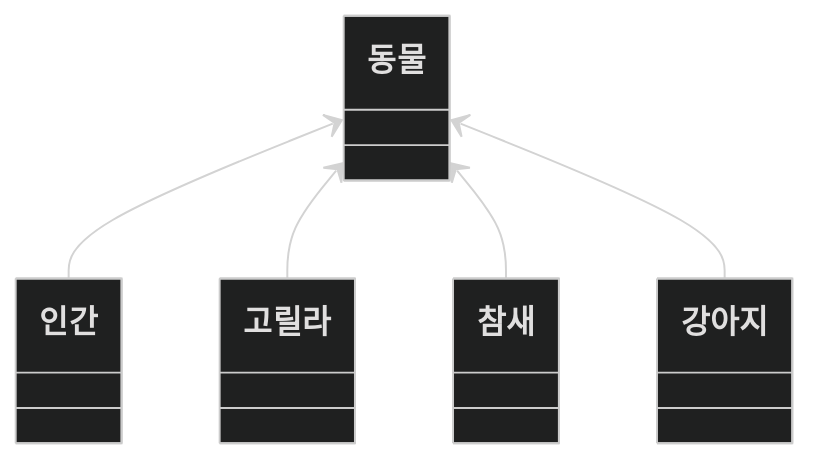
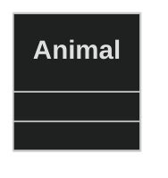
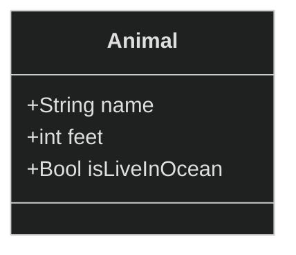
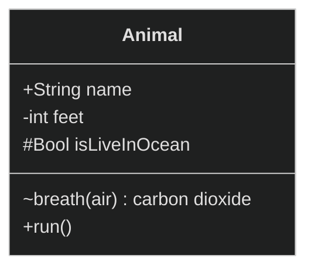

 
 
 

# class diagram

mermaid를 통해 class diagram을 그려보겠습니다.

보통 OOP를 표현하면서도 class diagram을 많이 사용합니다.
아래 class diagram을 보면 말하고자 하는 관계가 한눈에 파악되어 전달력이 뛰어난 것을 알 수 있습니다.

## class에 대해 

animal class를 만들며 class에 대해 알아보겠습니다. 
우선 아래와 같이 animal class를 선언 할 수 있습니다.

### class에 속성 부여하기

animal class에 여러 속성을 부여하겠습니다.

이름과 다리의 갯수, 
바다에 사는지 육지에 사는지를 가리는 boolean 값을 추가 할 수 있습니다.
property가 가지는 type을 정의해줄 수 있습니다.

### class에 메서드 부여하기

class에는 method가 있을 수 있습니다.
method는 인자와 반환값을 지정 할 수 있습니다.
반환값을 지정하지 않을 수도 있습니다.

### property와 method의 type에 대해
OOP를 배우다보면 캡슐화와 안전한 api를 만들기 위한 방법으로 제공되는 것이
접근 제어(visibility)입니다.

| 접근 제어자 | 설명 |
|--------------|------|
| **+ Public (Public)** | 어떤 클래스에서도 접근할 수 있음. 다른 클래스에서 해당 멤버(속성 또는 메서드)에 대한 접근이 허용됨. |
| **- Private (Private)** | 선언된 클래스 내에서만 접근할 수 있음. 다른 클래스에서는 해당 멤버에 접근할 수 없음. |
| **# Protected (Protected)** | 선언된 클래스와 그 하위 클래스에서 접근할 수 있음. 다른 클래스에서는 접근이 허용되지 않음. |
| **~ Package (Package)** | 동일 패키지 내에서만 접근할 수 있음. 다른 패키지의 클래스에서는 접근이 불가능하며, 명시적인 접근 제어자를 지정하지 않았을 때의 기본값. |

지금까지 만든 class에 접근 제어자를 변경해보도록 하겠습니다.

단일 class만 가지고 있어서는 해당 기능은 의미가 없습니다만, 여러 클래스가 연관 관계를 가지게 되면서
접근을 제어하게되면 강력한 힘을 발휘하게 됩니다.

class diagram의 **class**에 대해 알아봤습니다.
<a href="https://zerozoo-a.github.io/blog/Engineer-Information-Processing/UML-class-digram-2/">다음은 class가 서로 상호작용하는 </a>class diagram에 대해 알아보겠습니다.
