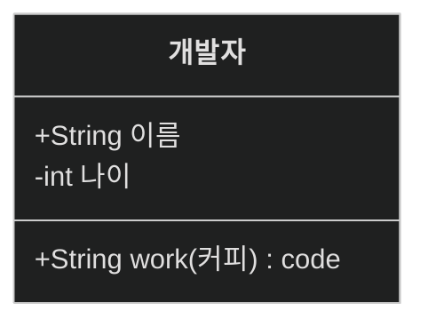
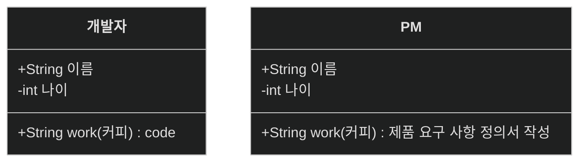
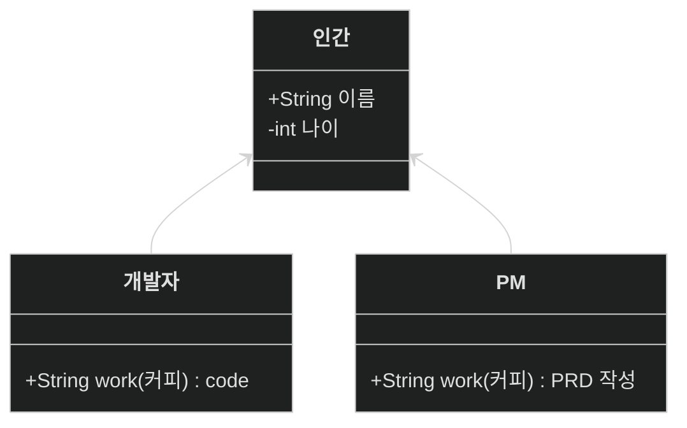
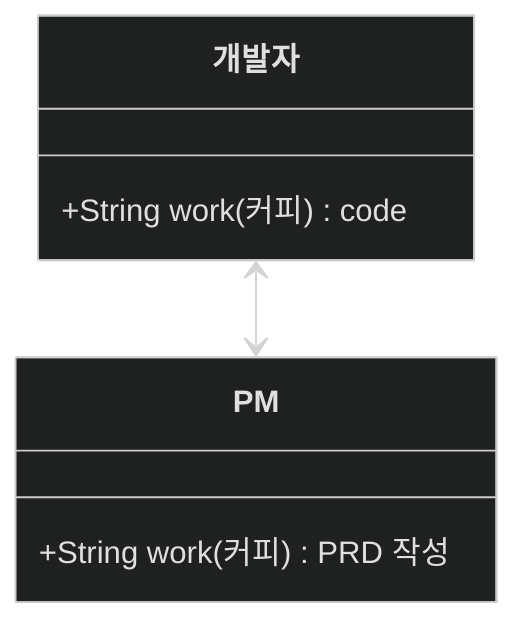
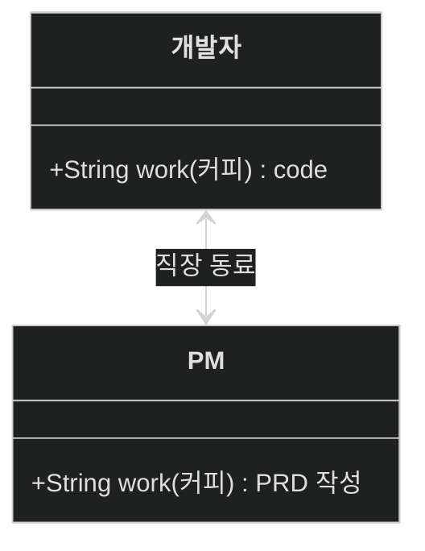

 
 
 

# class diagram 2

안녕하세요,

<a href="https://zerozoo-a.github.io/blog/Engineer-Information-Processing/UML-class-digram-1/">지난번의 포스트</a>에 이어 이번에도 하나의 클래스를 생성하고
이를 확장해가며 class diagram을 알아보는 시간을 가지겠습니다.

## class diagram의 관계

class diagram은 여러 객체간의 관계를 나타내는데 특화되어 있습니다.

아래 한 개발자 클래스를 생성해봤습니다.
그런데 개발자 혼자 뭘 할 수 있을까요? 

사업 아이템도 없고, 플랜도 없습니다.
(아래의 type들은 본인이 사용하는 언어의 타입에 맞게 사용해도 상관 없습니다.)

함께 일을 할 수 있는 환경을 조성하기 위해 동료(상사)를 추가해보겠습니다.

PM 친구를 추가했습니다만 곧바로 중복이 거슬립니다.
중복을 제거 할 겸 인간 class를 추가해보겠습니다.

이제 좀 마음이 편안해졌습니다.
여기서 중요한 점이 하나 더 있습니다.
화살표를 받고 있는 인간은 개발자와 PM을 모릅니다.

참조하는 측만 그 사실을 알면 됩니다.
이를 **단방향 연관 관계**라고 합니다.

개발자와 PM은 함께 일하는 동료입니다. 둘 사이는 확실히 관계가 성립합니다.
이를 표기해보겠습니다.

개발자와 PM의 관계를 보면 둘 모두 화살표 머리를 달고 있습니다.

이를 **양방향 연관 관계**라고 표현합니다.
둘 모두 서로의 존재를 알고 있습니다.

연관 관계를 연결하긴 했지만 둘이 어떤 관계인지 명시하고 싶을 경우
아래와 같이 작성할 수 있습니다.

둘은 직장 동료 관계임이 명확해졌습니다.

## 정리

이번엔 class diagram이 서로 상관 관계를 이루는 것에 대해 알아봤습니다.
다음엔 더 다양한 상관 관계 (Relationship)에 대해 알아보겠습니다.

