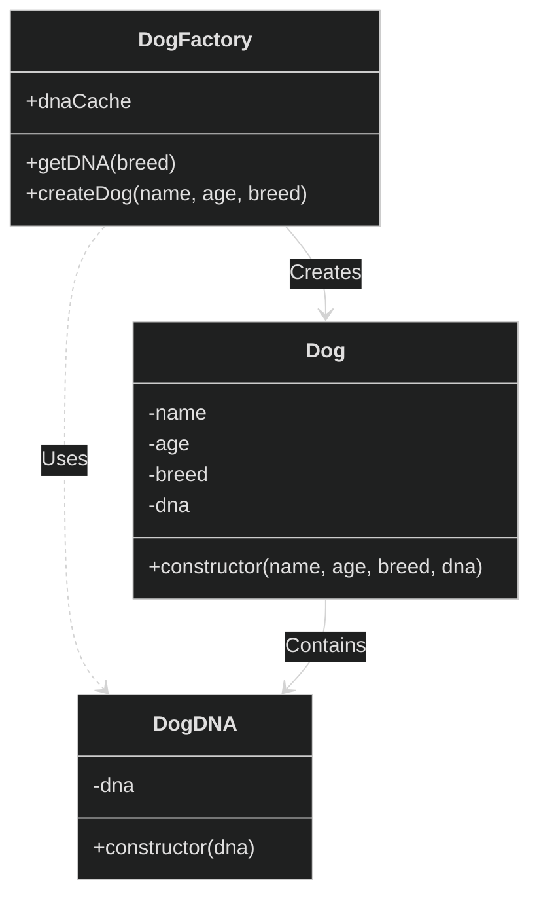

<br />
<br />
<br />

# flyweight pattern이란?

flyweight 패턴은 객체들 간에 중복되는 내부 상태를 공유하여 메모리를 절약하는 디자인 패턴입니다.

## 예시

강아지와 강아지의 DNA를 통해 flyweight pattern을 예로 들어보겠습니다.

강아지 객체는 강아지 클래스를 통해 생성합니다.

강아지 클래스는 이름, 나이, 종, dna를 입력받아 강아지 객체를 생성해줍니다.
dna는 메모리를 너무 많이 사용하므로 이를 강아지의 종마다 같은 dna를 사용하도록 공유하고 싶습니다.
(실제 dna는 물론 강아지마다 다릅니다.)

### 다이어그램



DogDNA의 메모리 사용을 줄이기 위해
사용 될 DNA를 강아지 객체 생성 전에 미리 값을 넣어줍시다.

구현 방식에 따라 다르지만 dna가 없는 경우 에러를 던져주거나
dna를 강아지 객체를 생성할 때 받아서 cache에 추가를 해주는 방법도 있습니다.


### 구현

```ts
class DogDNA {
  constructor(dna) {
    this.dna = dna;
  }
}

class Dog {
  constructor(name, age, breed, dna) {
    this.name = name;
    this.age = age;
    this.breed = breed;
    this.dna = dna;
  }
}

class DogFactory {
  static dnaCache = {};

  static getDNA(breed) {
    if (!this.dnaCache[breed]) {
      throw new Error("Runtime error: Breed DNA not found.");
    }
    return this.dnaCache[breed];
  }

  static createDog(name, age, breed) {
    const dna = this.getDNA(breed);
    return new Dog(name, age, breed, dna);
  }
}

const bulldog = "b".repeat(5500);
const chihuahua = "c".repeat(5500);
const poodle = "p".repeat(5500);

DogFactory.dnaCache["Bulldog"] = new DogDNA("abcBulldog" + bulldog);
DogFactory.dnaCache["Poodle"] = new DogDNA("abcPoodle" + poodle);
DogFactory.dnaCache["Chihuahua"] = new DogDNA("abcChihuahua" + chihuahua);

const s = process.memoryUsage().heapUsed;

const dog1 = DogFactory.createDog("jojo", 1, "Bulldog");
const dog2 = DogFactory.createDog("jotaro", 2, "Chihuahua");
const dog3 = DogFactory.createDog("popo", 4, "Poodle");
const dog4 = DogFactory.createDog("jomallon", 9, "Bulldog");
const dog5 = DogFactory.createDog("dodo", 2, "Chihuahua");
const dog6 = DogFactory.createDog("fodo", 3, "Chihuahua");
const dog7 = DogFactory.createDog("podo", 3, "Chihuahua");

const s2 = process.memoryUsage().heapUsed;

console.log(`flyweight: memory used: ${s2} - ${s}: ${s2 - s} bytes`);

```

이렇게 사용하는 경우 dnaCache에 적재된 메모리를 가리키므로,
각 객체별로 메모리를 사용하는 구현보다 메모리의 사용이 낮아집니다.

차이를 확인하기 위해 아래와 같이 일반적으로 객체가 각 속성의 메모리를 전부
사용하는 코드를 작성해봅시다.

### normal version
```js
class Dog {
  constructor(name, age, breed, dna) {
    this.name = name;
    this.age = age;
    this.breed = breed;
    this.dna = dna;
  }
}
const bulldog = "b".repeat(5500);
const chihuahua = "c".repeat(5500);
const poodle = "p".repeat(5500);

const s = process.memoryUsage().heapUsed;

const dog1 = new Dog("jojo", 1, "Bulldog", "abcBulldog" + bulldog);
const dog2 = new Dog("jotaro", 10, "Chihuahua", "abcChihuahua" + chihuahua);
const dog3 = new Dog("popo", 4, "Poodle", "abcPoodle" + poodle);
const dog4 = new Dog("jomallon", 9, "Bulldog", "abcBulldog" + bulldog);
const dog5 = new Dog("toto", 2, "Bulldog", "abcBulldog" + bulldog);
const dog6 = new Dog("foto", 2, "Bulldog", "abcBulldog" + bulldog);
const dog7 = new Dog("podo", 2, "Bulldog", "abcBulldog" + bulldog);

const s2 = process.memoryUsage().heapUsed;
console.log(`normal: memory used: ${s2} - ${s}: ${s2 - s} bytes`);

```

### 차이점 확인하기

#### normal version의 메모리 사용률
실험 결과: normal: memory used: 2692936 - 2689816: 3120 bytes

#### flyweight version의 메모리 사용률

실험 결과: flyweight: memory used: 2695256 - 2692360: 2896 bytes


여기서 주의 할 점은 flyweight의 경우 구현을 위해 클래스 객체를 더 많이 생성합니다.
따라서 클래스를 생성하고 힙 메모리에 저장하는 자바스크립트 특성상 기본적인 메모리 사용량이 더 높습니다.
