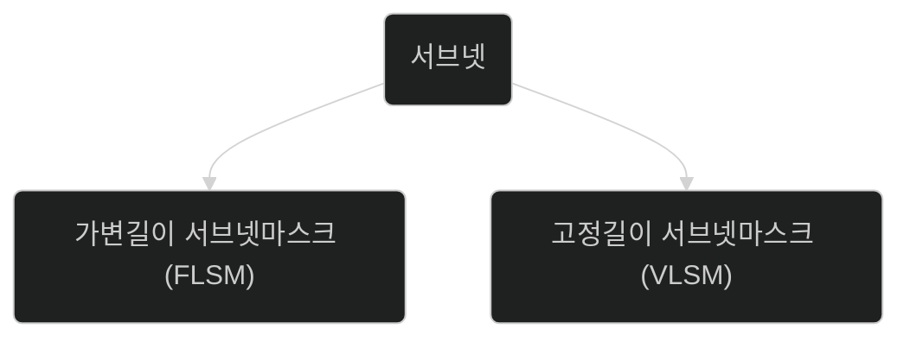
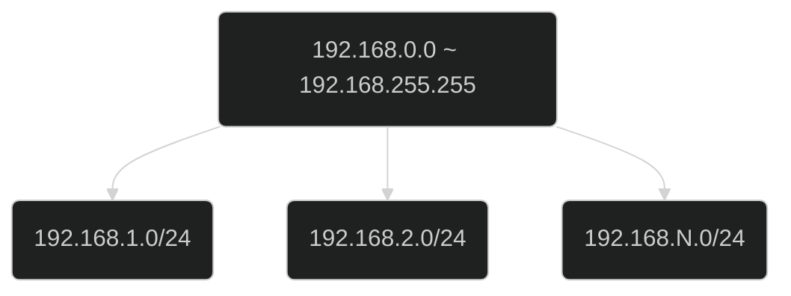

 
 
 

# 할당된 주소 범위를 나누는 서브넷

서브넷은 큰 네트워크를 정적 혹은 동적으로 나누는 것을 의미합니다.

> 여기서 말하는 큰 네트워크라는 것은 할당된 주소 범위를 의미합니다.
단일 주소가 아닌 주소의 범위를 ISP로부터 할당받은 주소 범위를 가리킵니다.

## 서브넷을 나누는 두가지 방법
이 주소 범위를 나누는 것을 서브넷이라고 하며 서브넷은 두가지로 방법으로 나뉩니다.

## 장점

- 서브넷은 네트워크 트래픽을 분산해 성능을 개선합니다.
- 각 서브넷은 서로 격리되어 있어 서브넷간 간섭이 없습니다.
- 서브넷은 네트워크 관리를 단순하게합니다.

## 예시
예를 들어, 

IP 주소 범위가 192.168.0.0 부터 192.168.255.255인 큰 네트워크를 범위를 
- 192.168.1.0/24 (0~255)
- 192.168.2.0/24 (0~255)
- 192.168.N.0/24 (0~255)

처럼 나눌 수 있습니다.

각 서브넷은 256개(0-255)의 IP 주소를 가질 수 있으며, 각각 독립적으로 작동합니다.

이제 서브넷을 나누는 알고리즘에 대해
알아보겠습니다.

## 고정 길이 서브넷 마스크 (FLSM)

- 정의: FLSM은 모든 서브넷이 동일한 크기를 가지는 서브넷팅 방식입니다. 즉, 모든 서브넷에 동일한 길이의 서브넷 마스크를 사용합니다.

- 사용: FLSM은 네트워크의 각 부분이 유사한 크기의 호스트 그룹을 필요로 할 때 사용됩니다.

- 단점: IP 주소 공간이 낭비될 수 있습니다. 예를 들어, 몇 개의 호스트만 필요한 작은 네트워크에도 불구하고, 더 큰 서브넷을 할당해야 할 수 있습니다.

### 예시

- 네트워크 주소 `192.168.1.0`를 가진 `/24` 서브넷 마스크를 가진 네트워크가 있는 경우를 가정하겠습니다.

`/24`는 CIDR 표기법으로 첫 24비트 즉 3 옥텟이 네트워크 ID로 사용되는 것을 의미하며
3 옥텟이 네트워크 ID로 사용되었으므로 마지막 옥텟을 호스트 ID로 사용 할 수 있습니다.

따라서 0부터 255까지 256개의 IP 주소를 포함하게 됩니다.

> 단, 실제 사용가능한 주소는 `256 - 2`개인데 두 주소를 빼는 이유는 prefix된 주소이기 때문입니다.
> - 네트워크 주소: `192.168.1.0`은 해당 주소를 식별하기 위한 네트워크 주소로 이미 정해져 있는 값입니다.
> - 브로드캐스트 주소: `192.168.1.255`는 해당 네트워크를 사용하는 모두에게 데이터를 동시에 전송하기 위한 주소입니다.

256개의 호스트를 4개의 서브넷으로 나누기 위해 호스트 주소 공간에서 2 비트를 네트워크 주소 공간으로 재할당합니다.
이는 위에서 설명한 `/24`가 `/26`이 된다는 의미입니다.
- 2 비트는 00, 01, 10, 11로 4개의 서브넷을 만들 수 있는 자리로 충분합니다.

> 네트워크 주소: `11111111 11111111 11111111` + 호스트 주소: `11111111` 
> 네트워크 주소: `11111111 11111111 11111111 11` + 호스트 주소: `111111`

호스트 주소 2비트를 네트워크 주소로 재할당했기 때문에 이제 호스트 주소는 6비트만이 남았습니다.

네트워크 주소 `192.168.1.0/26`일 때 서브넷을 4개로 나누어보면

1. 첫 서브넷: `192.168.1.0/26` (`192.168.1.0 - 192.168.1.63`)입니다.
   1. `192.168.1.0/26`를 서브넷 마스크로 표현하면 네트워크 주소를 1로 치환할 수 있습니다.
      1. `11111111.11111111.11111111.11000000`가 위 주소를 서브넷 마스크로 표현한 값입니다.
      2. 위 서브넷 마스크에서 호스트ID 부분인 `**0은 2진수로 6자리입니다.**` `6자리를 모두 1로 채울 경우 값은 63입니다.`
      3. 호스트ID 2자리를 네트워크ID로 치환한 부분은 **`00 ~ 11로 총 4가지 다른 네트워크를 가질 수 있습니다.`**
      4. **`4가지 다른 네트워크에 각각 63개의 서브넷팅`이 가능합니다.**
   

<!-- 한 기업에서 위 네트워크 주소를 /24인 C클래스로 

고정 길이 서브넷 마스크 방식으로 4개의 서브넷을 생성합니다. -->

