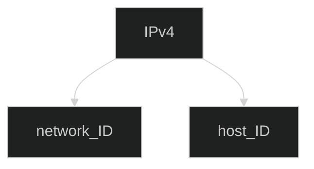
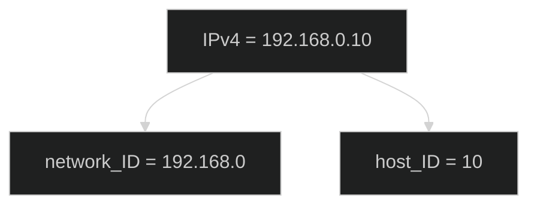

 
 
 

# IPv4 address에 대해서

- 구조

## 구조

IPv4 주소는 network ID와 host ID로 이루어져있습니다.

이를 그래프로 표현하면 아래와 같습니다.

실제 값을 대입해서 다시 그래프를 그려보겠습니다.

### 클래스에 따라 달라지는 network ID와 host ID의 길이

network ID와 host ID는 IPv4의 네트워크 클래스에 따라
network ID의 길이가 달라집니다.

총 32비트 길이에서 network ID가 네트워크 클래스에 의해 정해지면
나머지 비트는 host ID로 지정됩니다.

예를 들어 `클래스 A`는 `0.0.0.0 ~ 127.255.255.255`의 범위를 가지며
`클래스 A`의 host는 `0 ~ 127`까지이며
나머지는 255.255.255 host ID가 됩니다.

클래스 A의 경우 호스트 하나당 `2^8 * 2^8 * 2^8 -2`의 범위를 가집니다.
이 때, -2는 network ID와 broadcast 주소를 빼준 값입니다.

#### 서브넷 마스크

위에서 32비트로 IP주소를 표현한 것을 서브넷 마스크라고 합니다.

## IPv4 주소를 이루는 32비트

IPv4는 `0.0.0.0 ~ 255.255.255.255`까지 각 자리수는 8비트입니다.
  - 0부터 255까지 $2^8 = 256$입니다. 반대로 $log_2{256}=8$입니다. 이 때, 0을 포함해야하므로 -1을 해주면 255까지 입니다.
  - 255는 `11111111`으로 8비트를 나타냅니다.
  - 이를 4번 반복하여 IPv4는 32비트로 구성된다고 합니다.
  - `192.168.1.10`을 2진수로 치환하면 `11000000.10101000.00000001.00001010`이 됩니다.

## host ID

`192.168.1.10`에서 `10`은 host ID를 나타냅니다.
`192.168.1`이라는 네트워크 ID에서 특정 기기를 구분하기 위해 host ID가 존재합니다.

네트워크 모두에게 패킷을 보내는 특별한 주소를 broadcast IP라고 합니다.

host ID를 모두 1로 채운 경우 해당 네트워크의 broadcast IP가 됩니다.

`192.168.1.0`의 네트워크를 사용하는 경우 `192.168.1.255`가 broadcast IP가됩니다.

## 정리

- IPv4는 <a href="https://ko.wikipedia.org/wiki/%EB%B6%80%EB%B6%84%EB%A7%9D">서브넷마스크</a> 형태로 제공됩니다. `0.0.0.0 ~ 255.255.255.255`

- 서브넷 마스크는 A클래스부터 E클래스까지 구분됩니다.

- 서브넷 마스크의 network ID를 제외한 부분은 host ID가 되며, network ID는 네트워크에서 네트워크를 특정하기 위함이며 host ID는 특정 네트워크에서 각 기기를 특정하기 위함입니다.

- 서브넷 마스크의 각 자리는 0부터 255까지 8비트이며 8비트가 4개 모여 32비트로 표현됩니다.
  
- 브로드캐스트 IP와 네트워크 IP등 미리 지정된 IP가 존재합니다.

