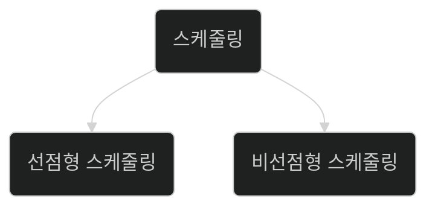

 
 
 

# OS의 프로세스 스케줄링

서로 다른 프로세스에서 돌고 있는 프로그램들은
하나의 CPU를 두고 함께 사용해야 합니다.

이는 공유 자원에 접근하는 쓰레드의 그것과
DB의 transition의 그것과 동일한 내용입니다.

스케줄링은 크게 아래와 같이 두가지로 나뉩니다.

선점형과 비선점형 스케줄링의 차이를 알아보겠습니다.

## 선점형 스케줄링

> 선점형 스케줄링은 한 프로세스가 CPU를 사용중이더라도
해당 CPU의 사용을 중단,
다른 스케줄링을 CPU에 선점 할 수 있게 합니다.

- 특징:
  - `응답 시간의 개선`: 다수의 사용자, 중요한 프로세스에 대해 빠른 응답을 제공합니다.
  - `자원의 공유`: CPU를 공정하게 여러 프로세스 간에 공유되도록 합니다.
  - `복잡성`: 스케줄링 알고리즘이 이미 CPU를 점유하고 있는 프로그램의 실행 상태를 대기로 변경시키고 자신의 프로세스를 CPU에 태우는 것이므로 보다 복잡해집니다.
    - 스케줄링 알고리즘에 따라 특정 프로세스는 `기아 상태`에 빠질 수 있습니다.

### 선점형 스케줄링에서 사용되는 알고리즘

- Round Robin: <a href="https://ko.wikipedia.org/wiki/%EB%9D%BC%EC%9A%B4%EB%93%9C_%EB%A1%9C%EB%B9%88_%EC%8A%A4%EC%BC%80%EC%A4%84%EB%A7%81">라운드 로빈 스케줄링</a>은 시분할 시스템을 위해 설계된 선점형 스케줄링입니다.

프로세스들간의 우선순위 없이 각 프로세스를 공평하게 시분할로 나누어 
Queue에 담아둡니다.

시간만큼 CPU를 차지한 프로세스는 종료 상태가 아니라면 Queue의 맨 뒤에 다시 추가합니다.

- 우선순위 기반 스케줄링
- 다단계 피드백 큐 스케줄링
등이 있습니다.

## 비선점형 스케줄링

> 비선점형 스케줄링은 한 프로세스가 CPU를 할당받으면 작업을 완료하거나 I/O요청으로 블록될 때까지 CPU를 선점합니다.

- 특징: 
  - 단순함: 이미 CPU를 차지한 경우 프로세스가 완료되기 전까지
혹은 I/O 블록이 생기기 전까지 CPU를 계속 독점합니다.
  - 자원 활용 문제: 프로세스가 긴 경우 자원이 독점될 수 있습니다. 

### 비선점형 스케줄링에서 사용되는 알고리즘

- First-Come
- First-Served
- Shortest Job First
- 우선순위 스케줄링(비선점형 버전)
  등이 존재합니다.