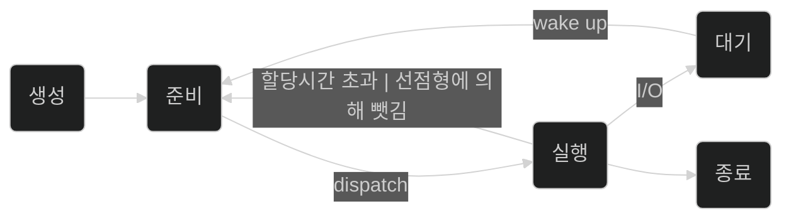

 
 
 

# 프로세스의 상태

프로세스는 `라이프사이클`을 갖습니다.

프로세스 라이프사이클은 프로세스의 생애주기를 나타냅니다.  

`graph`로 나타내면 아래와 같이 표현됩니다.

그 주요 주기는 아래의 5가지입니다.

- 생성: 프로세스가 생성되고 초기화됩니다.
  - 전환: 프로세스가 모든 자원을 필요한 자원을 할당받으면, `준비 상태로 전환`됩니다. 

- 준비: 프로세스가 CPU를 제외한 모든 자원을 할당받은 상태입니다.
  - 전환: 프로세스가 CPU 할당을 받으면 `실행 상태로 전환`됩니다. 

- 실행: CPU를 할당받아 명령어를 실행하는 상태입니다.
  - 전환 1: I/O 요청에 들어가면 `대기 상태로 전환`되며 프로세스를 놓아줍니다.
  - 전환 2: <a href="/blog/Engineer-Information-Processing/os-process-scheduling/">선점형 스케줄링</a>에 의해 CPU를 빼앗기면, `준비 상태로 전환`됩니다.
  - 전환 3: 실행을 완료하면, `종료 상태로 전환`됩니다.

- 대기: 프로세스가 I/O 작업과 같은 이벤트의 완료를 기다립니다. 
  - 전환: CPU가 언제 끝날지 알 수 없는 대기 작업에 할당되지 않도록 
`준비 상태로 전환`됩니다.

- 종료: 실행이 완료된 상태입니다. 할당받은 자원을 모두 OS에 반납하고 프로세스 테이블에서 제거됩니다. 
  - 전환: 없음

### dispatch(디스패치)

준비 상태에 있는 여러 프로세스 중 실행될 프로세스를 선정해 
CPU를 할당(dispatch)합니다. 이 때, context switch 비용이 발생됩니다.

### timeout | 선점형 스케줄링에 의해 뺏김

프로세스는 스케줄링된 조건에 따라 CPU 할당을 빼앗길 수 있습니다.
스케줄러에 의해 PCB에 내용을 저장, CPU를 반납하게 되고
`준비상태로 전환`됩니다.

### I/O

I/O와 즉시 실행 불가능한 시스템 콜, 프로세스간 통신(IPC)등 Block이 발생됩니다.

이 때 CPU를 할당을 반납하고 `대기상태로 전환`됩니다.

### Wake up

입출력이 종료되면 대기 상태의 프로세스에게 전달합니다.
대기 상태에서 `준비 상태로 전환`되며 스케줄링에 의해 다시 실행을 기다립니다.