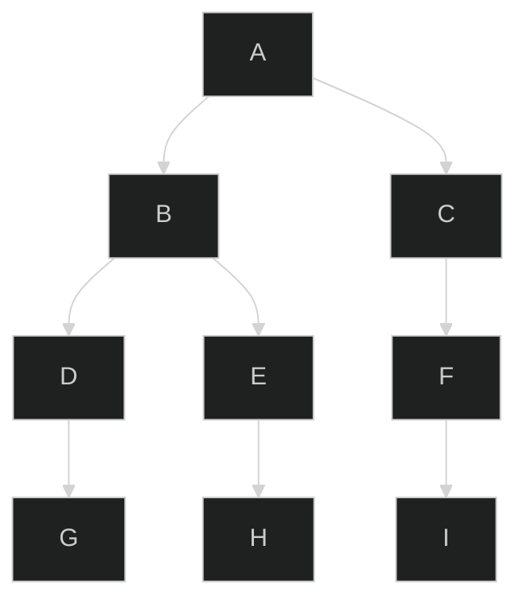
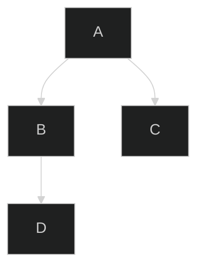

<br />
<br />
<br />


# 깊이 우선 탐색

- 깊이 우선 탐색: 트리를 포함한 그래프에서 사용되는 알고리즘으로 <br> 시작 그래프에서부터 가능한 깊게 탐색해 <br> 원하는 결과값을 찾는 알고리즘입니다.


## 대상이 될 그래프

그래프를 한눈에 보기 쉽게 표현하면 아래와 같습니다.



자바스크립트로 표현하면 아래와 같이 표현 가능합니다. <br>

```js
const graph = {
    A: ["B", "C"],
    B: ["D", "E"],
    C: ["F"],
    D: ["G"],
    E: ["H"],
    F: ["I"]
}
```

이제 이 그래프를 dfs를 이용해서 탐색해보겠습니다.

## dfs를 이용해서 탐색하기

iterative한 dfs 탐색은 stack을 기반으로 탐색합니다.

위에서 예시로 든 그래프를 기반으로 탐색하는 것은 생각보다 시간이 너무 오래걸리니 그래프를
작게 다시 만들어 보겠습니다.



```js
const graph = {
    A:["B", "C"],
    B: ["D"]
}
```

만만해진 그래프를 가지고 dfs 알고리즘을 설명하겠습니다.

dfs를 반복문으로 풀어내는 경우 stack이 사용됩니다.

## dfs와 잘어울리는 stack


<a href="/blog/data-structure/reference-of-stack/"> stack의 표현</a>은 
링크의 설명을 참고해주세요

위 그래프를 stack을 쌓고 터트리는 과정을 통해 설명하겠습니다.


|nil|
|-|

|A(p)|
|-|

- 노드의 시작점인 A를 stack에 쌓습니다.
- stack을 pop하면서 log를 통해 내보냅니다.
- A가 가리키고 있는 노드에 대해 반복문을 돌고 차례대로 stack에 push 합니다.

|C(p)|
|-|
|B|

- stack을 pop하면서 log를 통해 내보냅니다.
- C가 가리키고 있는 노드가 있는지 확인해보지만 C는 엣지를 가지고 있지 않습니다.
- pop되어집니다.

|B(p)|
|-|

- stack을 pop하면서 log를 통해 내보냅니다.
- B가 가리키고 있는 노드에 대해 반복문을 돌고 차례대로 stack에 push 합니다.

|D(p)|
|-|

- stack을 pop하면서 log를 통해 내보냅니다.
- D가 가리키고 있는 노드가 있는지 확인해보지만 D는 엣지를 가지고 있지 않습니다.

|nil|
|-|

- stack이 모두 비워졌습니다. 그래프를 모두 순회했습니다.

## 이미 방문한 노드를 체크하는 visited

- 위 스택의 설명에는 나와있지 않지만 아래 dfs에선 하나의 자료구조를 더 사용합니다.
- Set입니다. 이는 이미 방문한적이 있는 node를 걸러주기 위해 존재합니다.

예를 들어 그래프를 아래와 같이 작성한다면 어떨까요?

```js
const graph = {
  A: ["B", "C"],
  B: ["A"],
};
```
A는 B를 가리키고 C는 따로 가리키는 노드가 없습니다.
B는 다시 A를 가리킵니다.

반복문에서 B는 그래프의 A를 다시 지목해 B, C를 스택에 쌓고
B를 pop할 때, B는 A를 다시 지목하여 무한 반복됩니다.
따라서 이 순환을 끊기 위해서는 이를 기록하는 visited 변수가 필요합니다.

## 구현

위 모든 과정을 코드로 표현하면 아래와 같이 표현됩니다.

```js
function dfs(graph, start) {
  const stack = [start]; // 시작 노드를 stack으로 만듭니다.
  const visited = new Set(); // 방

  while (stack.length) {
    let currentNode = stack.pop();
    visited.add(currentNode);
    console.log(currentNode);

    if (graph[currentNode]) {
      graph[currentNode].forEach((node) => {
        if (!visited.has(node)) stack.push(node);
      });
    }
  }
}

const graph = {
  A: ["B", "C"],
  B: ["D"],
};

dfs(graph, "A");
```

## 정리

기본적인 구현은 위와 같으나 이를 다양하게 응용한 문제와 사용례들이 존재합니다.

다음엔 이를 응용한 미로탐색을 알아보겠습니다.

감사합니다.
