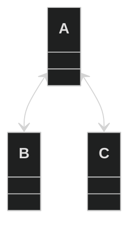

<br />
<br />
<br />


# 깊이 우선 탐색(DFS)이란

깊이 우선 탐색은 트리나 그래프 자료구조를 깊이를 우선해서 탐색하는
알고리즘을 의미합니다.


## 수도 코드 예시

대략 아래와 같은 그래프가 존재할 때,



서로 존재를 알고 있어야 하는 그래프이므로 
간단한 수도코드처럼 작성해보겠습니다.

```js
// 그래프
const graph = {
};

// 각 vertex 생성
graph.A = [];
graph.B = [];
graph.C = [];

// edge 연결

// A와 B연결 
graph.A.push("B");
graph.B.push("A");

// C와 A연결
graph.A.push("C");
graph.C.push("A");
```
연결이라고 해도, 각 vertex를 서로 찾아갈 수 있는 
해시 키를 상호간 등록하는 것이 전부입니다.

위 코드로인해 각 vertex의 간선(edge)들은 연결되었습니다.

## iterative dfs

```js
function iterativeDFS(startVertex, adjacencyGraph) {
  if (!startVertex || !adjacencyGraph) return;

  const stack = [startVertex]; // stack에 가장 첫 vertex 값을 넣습니다.
  const result = []; 
  const visited = {}; // 방문한 vertex를 기록하고 두번 방문하지 않도록 체크하는 용도입니다.
  let currentVertex;

  visited[startVertex] = true; // 첫 vertex

  while (stack.length) {
    currentVertex = stack.pop(); // 현재 stack을 Pop해서 현재 vertex로 이동합니다.
    result.push(currentVertex); // vertex에 도착했으므로 중복된 방문이 아닙니다, result에 값을 밀어 넣습니다.

    adjacencyGraph[currentVertex].forEach((neighbor) => { // 현재 vertex와 연결된 vertex 수 만큼 반복문을 실행합니다.
      if (visited[neighbor]) return; // 이미 방문한적이 있다면 스킵합니다.

      visited[neighbor] = true; // 방문한적이 없다면 visited에 해당 vertex를 true로 기록합니다.
      stack.push(neighbor); // stack에 밀어 넣습니다.
    }); 
    // 반복문이 종료되면 stack의 수가 늘어나 while문이 종료되지 않습니다. stack에 밀어넣어 두었던
    // vertex들이 stack pop에 의해 currentVertex가 됩니다.
  }

  return result;
}
```


## 사유실험하기
```js
// 그래프
const graph = {
};

// 각 vertex 생성
graph.A = [];
graph.B = [];
graph.C = [];

// edge 연결

// A와 B연결 
graph.A.push("B");
graph.B.push("A");

// C와 A연결
graph.A.push("C");
graph.C.push("A");

function iterativeDFS(startVertex, adjacencyGraph) {
  if (!startVertex) return;

  const stack = [startVertex];
  const result = [];
  const visited = {};
  let currentVertex;

  visited[startVertex] = true;

  while (stack.length) {
    currentVertex = stack.pop();
    result.push(currentVertex);

    adjacencyGraph[currentVertex].forEach((neighbor) => {
      if (visited[neighbor]) return;

      visited[neighbor] = true;
      stack.push(neighbor);
    });
  }

  return result;
}
```
위 코드를 머리속으로 실행해보겠습니다.

DFS의 시작점이되는 A는 visited에 true로 표기되어집니다. ⤵️
```js
const visited = {
    A: true
};
```


vertex A는 vertex B, C를 가리키고 있고,
B, C는 A를 가리키고 있습니다. ⤵️

```js
 const graph = {
   A: ["B", "C"],
   B: ["A"],
   C: ["A"]
 };
```

`vertex A`의 배열 값을 순회하면서
 - `stack`에 `B, C`를 추가합니다.
 - `B, C`를 `visited`에 추가합니다.
   - 현재 vertex에서 이동 가능한 모든 경로를 확인하고 `visited`에 추가하는 것입니다.
   - 그 후에 stack에 모두 밀어넣습니다.

`stack.pop()`을 통해 값을 꺼내오므로
`C` 값을 먼저 꺼내옵니다.

`C`가 가진 근접 `vertex`들을 순회합니다.
`A`밖에 없습니다. visited에 의해 더 확인할 vertex가 없습니다.

다시 `while`문 검사로 올라갑니다.
stack을 터트려 `B`를 확인합니다.

`B` 또한 근접 `vertex`는 `A`밖에 없습니다.

`stack`의 길이는 모두 소진되어 반복문을 빠져나오게 됩니다.
`dfs함수`는 `result`를 반환하고 종료됩니다. 


## 정리

- 사용예
```js
const graph = {
  A: ['B', 'C'],
  B: ['A', 'D'],
  C: ['A', 'D'],
  D: ['B', 'C']
};

const result = iterativeDFS('A', graph);
console.log(result);
// [A, C, D, B]
```

- 각 vertex는 서로를 link하기 위해 아래와 같은 형태로 저장 될 수 있다.
```js
 const graph = {
   A: ["B", "C"],
   B: ["A"],
   C: ["A"]
 };
```

- 첫 시작 vertex는 근접 vertex를 방문한적 있는지 검사한다.
- 방문한적이 없다면 stack에 밀어넣는다.
- 처음 방문한 vertex는 result stack에 push한다.