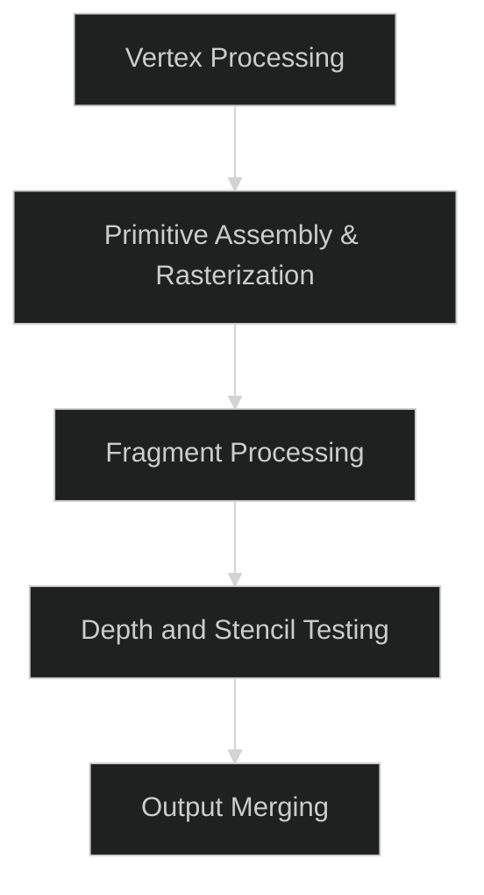

<br />
<br />
<br />

# WebGPU 정리

## 글의 목적: WebGPU의 대략적인 작동방식의 이해

> WebGPU를 사용하기전 참고차 정리합니다.

- WebGPU는 gpu 자원을 사용한 병렬 연산에 특화되어 있습니다.
  - 이는 꼭 gpu 자원을 사용한 연산이 그래픽에만 사용된다는 것을 의미하지 않고, 더 넓은 사용성을 가진다는 것을 뜻합니다.
    - 예를 들어 tensorflow.js등에서도 사용중입니다.
- WebGPU는 gpu의 job queue에, shader 언어로 작성된 그래픽 작업을 요청하는 것입니다.
  -  그래픽 작업은 렌더링 파이프라인의 형태로 작성됩니다.

## 렌더링 파이프라인 간보기

렌더링 파이프라인은 개발자가 GPU의 계산 능력을 활용해 고성능 그래픽스 및 계산 작업을 수행하도록 합니다.
WebGPU는 아래와 같은 렌더링 파이프라인을 지나가며 그래픽 작업을 수행합니다.



렌더링 파이프라인은 컴퓨터 그래픽스에서 아주 중요한 내용인지라 나중에 다시 다루어보겠습니다.

## Hello, 삼각형

WebGPU를 사용해 삼각형을 그려보겠습니다.

```ts
// 최신 browser 환경 기준

/**
 * WebGPU를 사용하기 위한 browser api들을 initialize합니다.
 */
async function init() {
	try {
		const canvas = document.getElementById("canvas") as
			| HTMLCanvasElement
			| null
			| undefined;
		if (!canvas) throw Error("canvas is required");

		const adapter = await navigator.gpu.requestAdapter();
		if (!adapter) throw Error("navigator gpu");

		const device = await adapter.requestDevice();
		const context = canvas.getContext("webgpu");

		if (!canvas || !context || !device)
			throw Error("canvas, context, device is required");

		return {
			canvas,
			device,
			context,
		};
	} catch (e) {
		console.error(e);
		return {
			canvas: null,
			device: null,
			context: null,
		};
	}
}
```

```ts
/** 
 * 모든 함수가 집합될 main 함수입니다.
*/
async function main(wgls: string[]) {
    const { canvas, context, device } = await init();
	if (!(canvas || context || device))
		throw Error("canvas, context, device is required");

    // ...
}
```


```ts
/**
 * wgls입니다. js의 string 타입으로 작성 가능합니다.
 * 
 * vertex와 fragment로 나뉘어져 있습니다.
 */
const vertexShaderCode = `
        @vertex
        fn main(@builtin(vertex_index) VertexIndex : u32) -> @builtin(position) vec4<f32> {
            var positions = array<vec2<f32>, 3>(
                vec2<f32>(0.0, 0.5),
                vec2<f32>(-0.5, -0.5),
                vec2<f32>(0.5, -0.5)
            );
            let position = positions[VertexIndex];
            return vec4<f32>(position, 0.0, 1.0);
        }`;

const fragmentShaderCode = `
        @fragment
        fn main() -> @location(0) vec4<f32> {
            return vec4<f32>(0.0, 1.0, 0.0, 1.0); // RGBA: Green
        }`;
```

전체 코드는 아래와 같습니다.

```ts
async function main(wgls: string[]) {
	/** 필수 object들에 대한 init */
	const { canvas, context, device } = await init();
	if (!(canvas || context || device))
		throw Error("canvas, context, device is required");

	/** 캔버스의 컨텍스트 구성 */
	const format = "bgra8unorm";
	context.configure({
		device,
		format,
	});

	/** 컨텍스트의 텍스쳐 구성 */
	const textureView: GPUTextureView = context.getCurrentTexture().createView();
	/** 렌더 패스 설정을 정의합니다. 여기서는 색상 버퍼를 지우고 저장하는 방법을 지정합니다. */
	const renderPassDescriptor: GPURenderPassDescriptor = {
		colorAttachments: [
			{
				view: textureView,
				clearValue: { r: 0, g: 0, b: 0, a: 1 },
				loadOp: "clear",
				storeOp: "store",
			},
		],
	};

	/** vertex, fragment shader를 module을 생성합니다.*/
	const [vertexShaderModule, fragmentShaderModule] = createShaderModules(
		wgls,
		device
	);

	/** rendering pipeline을 생성하며, shader와 rendering 설정을 포함합니다. */
	const pipeline = device.createRenderPipeline({
		vertex: {
			module: vertexShaderModule,
			entryPoint: "main",
		},
		fragment: {
			module: fragmentShaderModule,
			entryPoint: "main",
			targets: [
				{
					format,
				},
			],
		},
		primitive: {
			topology: "triangle-list",
		},
		layout: "auto",
	});
	/** GPU에 명령을 전달하기 위한 encoder를 생성합니다. */
	const commandEncoder = device.createCommandEncoder();

	const passEncoder = commandEncoder.beginRenderPass(renderPassDescriptor);
	passEncoder.setPipeline(pipeline); // pipeline을 설정
	passEncoder.draw(3, 1, 0, 0); // 세 개의 꼭짓점으로 삼각형 그리기
	passEncoder.end(); // render pass 작성을 종료합니다.
	device.queue.submit([commandEncoder.finish()]); // gpu의 queue에 작업을 밀어넣습니다.
}

async function init() {
	try {
		const canvas = document.getElementById("canvas") as
			| HTMLCanvasElement
			| null
			| undefined;
		if (!canvas) throw Error("canvas is required");

		const adapter = await navigator.gpu.requestAdapter();
		if (!adapter) throw Error("navigator gpu");

		const device = await adapter.requestDevice();
		const context = canvas.getContext("webgpu");

		if (!canvas || !context || !device)
			throw Error("canvas, context, device is required");

		return {
			canvas,
			device,
			context,
		};
	} catch (e) {
		console.error(e);
		return {
			canvas: null,
			device: null,
			context: null,
		};
	}
}

function createShaderModules(
	wgls: string[],
	device: GPUDevice,
	map?: (value: string, index: number, array: string[]) => GPUShaderModule
): GPUShaderModule[] {
	return map
		? wgls.map(map)
		: wgls.map((wgl) => device.createShaderModule({ code: wgl }));
}

/** wgls입니다. 강타입언어로 js를 이용해 string타입으로 WebGPU API에 넘겨주는 형태가 됩니다. */
const vertexShaderCode = `
        @vertex
        fn main(@builtin(vertex_index) VertexIndex : u32) -> @builtin(position) vec4<f32> {
            var positions = array<vec2<f32>, 3>(
                vec2<f32>(0.0, 0.5),
                vec2<f32>(-0.5, -0.5),
                vec2<f32>(0.5, -0.5)
            );
            let position = positions[VertexIndex];
            return vec4<f32>(position, 0.0, 1.0);
        }`;

const fragmentShaderCode = `
        @fragment
        fn main() -> @location(0) vec4<f32> {
            return vec4<f32>(0.0, 1.0, 0.0, 1.0); // RGBA: Green
        }`;

/** window가 로드되면 wgls를 main함수에 넘겨주면서 gpu를 이용한 렌더링이 시작됩니다. */
window.onload = () => main([vertexShaderCode, fragmentShaderCode]);
```
아래에 위 코드를 작동시켰을 경우 WebGPU를 사용 할 수 있는 환경이라면,
검은 바탕에 초록색 삼각형이 canvas에 그려진 것을 확인 할 수 있습니다.

혹은 <a href="/sub_domains/web_gpu/src/examples/triangle/">이 링크를 통해서도 확인 가능합니다.</a>

<canvas id="canvas"></canvas>

<script>
        (function(){const t=document.createElement("link").relList;if(t&&t.supports&&t.supports("modulepreload"))return;for(const e of document.querySelectorAll('link[rel="modulepreload"]'))i(e);new MutationObserver(e=>{for(const r of e)if(r.type==="childList")for(const o of r.addedNodes)o.tagName==="LINK"&&o.rel==="modulepreload"&&i(o)}).observe(document,{childList:!0,subtree:!0});function s(e){const r={};return e.integrity&&(r.integrity=e.integrity),e.referrerPolicy&&(r.referrerPolicy=e.referrerPolicy),e.crossOrigin==="use-credentials"?r.credentials="include":e.crossOrigin==="anonymous"?r.credentials="omit":r.credentials="same-origin",r}function i(e){if(e.ep)return;e.ep=!0;const r=s(e);fetch(e.href,r)}})();

    async function v(){const r=document.getElementById("canvas"),t=await navigator.gpu.requestAdapter(),e=await(t==null?void 0:t.requestDevice()),n=r.getContext("webgpu");if(!r||!n||!e)return;const i="bgra8unorm";n.configure({device:e,format:i});const c=`
        @vertex
        fn main(@builtin(vertex_index) VertexIndex : u32) -> @builtin(position) vec4<f32> {
            var positions = array<vec2<f32>, 3>(
                vec2<f32>(0.0, 0.5),
                vec2<f32>(-0.5, -0.5),
                vec2<f32>(0.5, -0.5)
            );
            let position = positions[VertexIndex];
            return vec4<f32>(position, 0.0, 1.0);
        }`,s=`
        @fragment
        fn main() -> @location(0) vec4<f32> {
            return vec4<f32>(0.0, 1.0, 0.0, 1.0); // RGBA: Green
        }`,d=e.createShaderModule({code:c}),u=e.createShaderModule({code:s}),l=e.createRenderPipeline({vertex:{module:d,entryPoint:"main"},fragment:{module:u,entryPoint:"main",targets:[{format:i}]},primitive:{topology:"triangle-list"},layout:"auto"}),a=e.createCommandEncoder(),m={colorAttachments:[{view:n.getCurrentTexture().createView(),clearValue:{r:0,g:0,b:0,a:1},loadOp:"clear",storeOp:"store"}]},o=a.beginRenderPass(m);o.setPipeline(l),o.draw(3,1,0,0),o.end(),e.queue.submit([a.finish()])}window.onload=v;

</script>