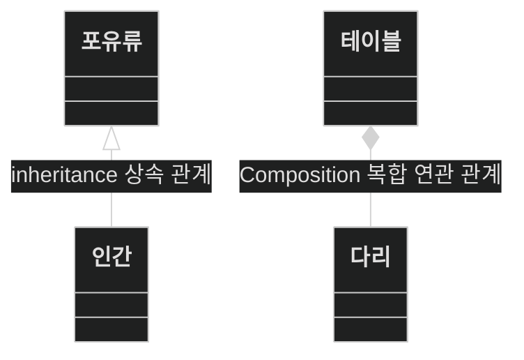
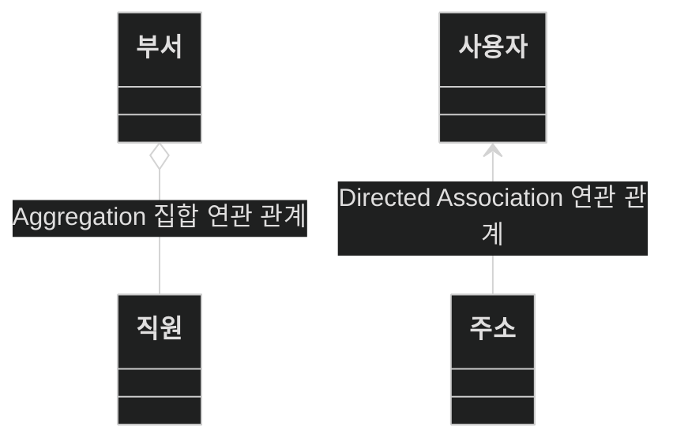
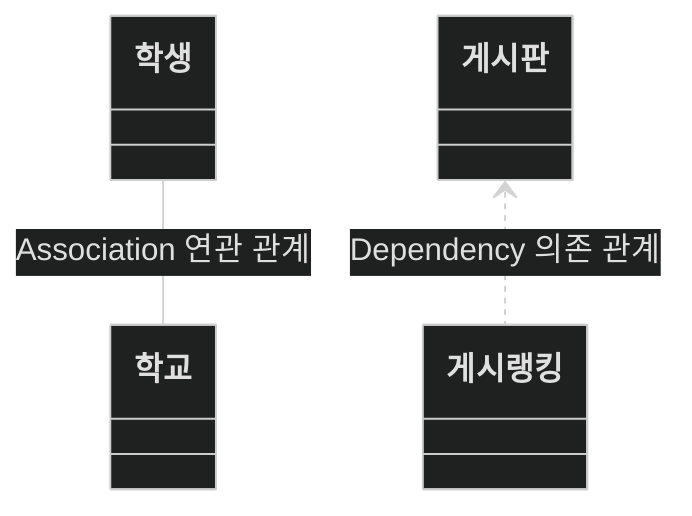
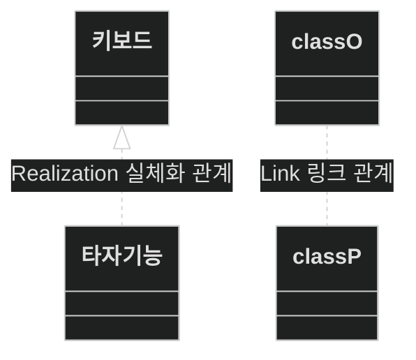

 
 
 

# class diagram

안녕하세요,

```mermaid
%%{init: {'theme':'dark'}}%%
classDiagram
포유류 <|-- 인간: inheritance 상속 관계
테이블 *-- 다리: Composition 복합 연관 관계
```

```mermaid
%%{init: {'theme':'dark'}}%%
classDiagram
부서 o-- 직원: Aggregation 집합 연관 관계
사용자 <-- 주소: Directed Association 연관 관계
```

```mermaid
%%{init: {'theme':'dark'}}%%
classDiagram
학생 -- 학교: Association 연관 관계
게시판 <.. 게시 랭킹: Dependency 의존 관계
```

```mermaid
%%{init: {'theme':'dark'}}%%
classDiagram
키보드 <|.. 타자기능: Realization 실체화 관계
classO .. classP: Link 링크 관계
```