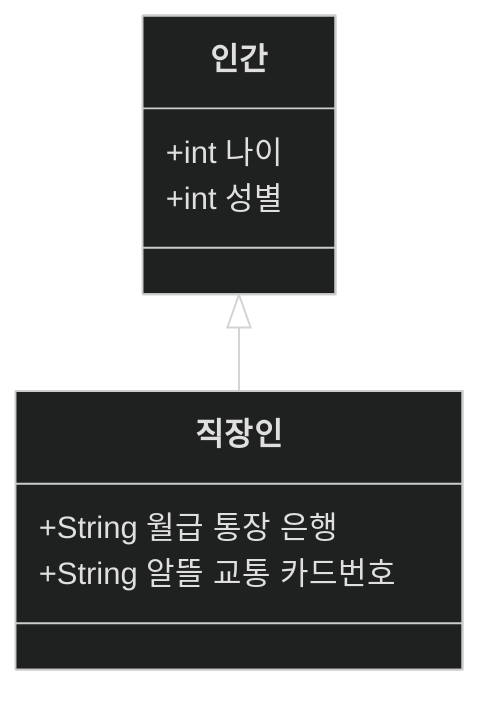
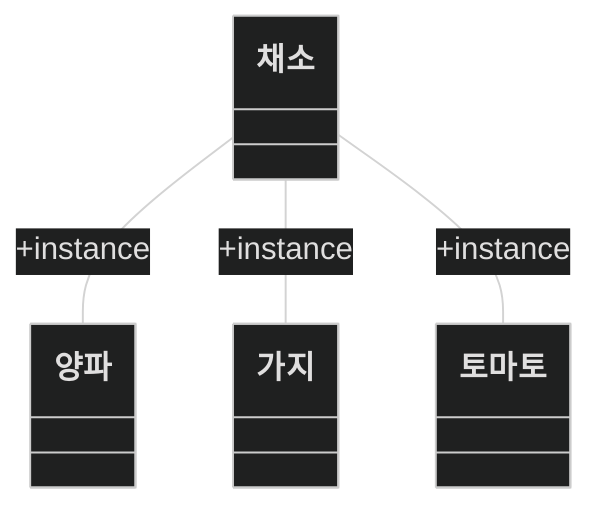
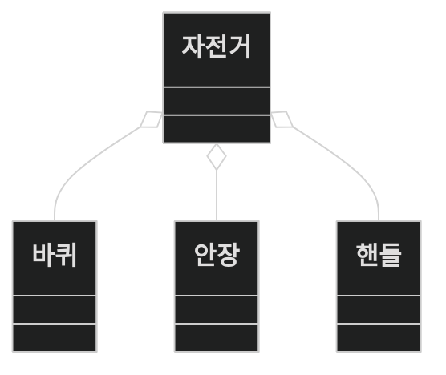
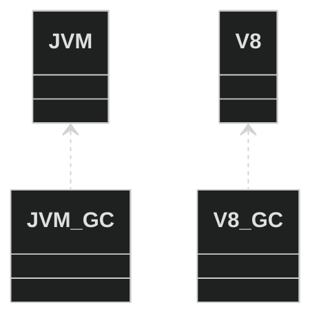
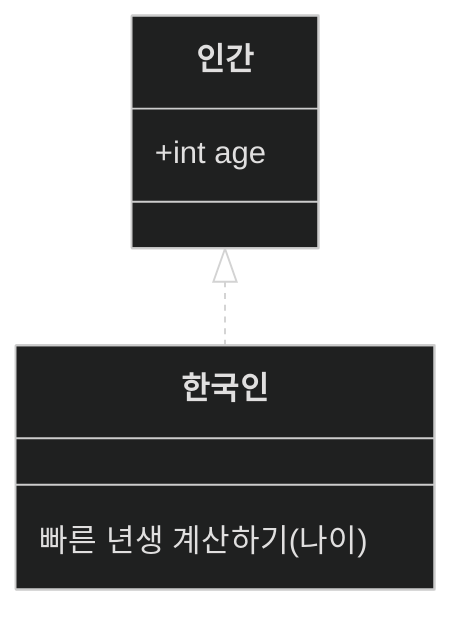

 
 
 

# class diagram 3

안녕하세요,

<a href="https://zerozoo-a.github.io/blog/%EC%A0%95%EC%B2%98%EA%B8%B0/UML-class-digram-2/">지난번의 포스트</a>에 이어

상관 관계(Relationship)에 대해 더 알아보겠습니다.

## Relationship

class diagram에는 여러 상관 관계가 존재합니다.

이번에도 하나씩 예를 들어가며 확인해보겠습니다.

## Inheritance 상속 관계

인간 클래스와 인간 클래스를 상속받는 직장인 클래스를 생성해보겠습니다.

직장인 클래스는 인간 클래스를 상속받는 관계입니다.

## Association / Generalization (연관 / 일반화) 관계

연관 관계는 시스템 내에서 서로 다른 객체가 연결되어 있는 구조적 관계를 나타냅니다.

연관 관계는 두 가지로 다시 분류됩니다.
1. Reflexive Association

양파와 가지, 토마토는 채소 클래스에 속합니다.
위에서 본 Inheritance와 비슷한 역할을 수행합니다.

2. Directed Association

참조하는 쪽과 참조 당하는 쪽을 강조합니다.
직장인은 회사를 위해 일합니다.
회사는 직장인을 위해 일해주지 않습니다.

## Aggregation 집합 연관 관계

집합 연관 관계는 클래스간의 부분과 전체의 관계입니다.
전체는 부분을 소유하는 개념을 강하게 의미합니다.

## Composition 합성(복합) 연관 관계

복합 관계는 집합 연관 관계와 같으나,
전체가 삭제될 경우 부분도 함께 사라지는 것을 의미합니다.

위의 예를 들어 전체 클래스인 자전거가 삭제될 경우,
바퀴는 남아도 상관 없는 것입니다.

부분과 전체를 이루는 관계는 무엇이 있을까요?
JVM이나 v8 engine의 런타임을 예로 들어보겠습니다.

둘 다 모두 성능 좋은 GC를 달고 있습니다.

VM 환경이 사라지면 GC도 함께 사라지게 됩니다.

- 마름모꼴이 칠해져 있어 더 강하게 엮여있다고 생각하면 좋겠습니다.

## Dependency 의존 관계

한 클래스의 변화가 다른 클래스에 영향을 미치는 관계입니다.

위의 예를 그대로 의존 관계로도 설명해보겠습니다.

GC의 설정을 최대한 안좋게 변경하면 각각의 VM은 낮은 퍼포먼스를 보이게됩니다.
GC를 변경했지만 VM도 영향을 받는 상황입니다.

이렇게 같은 class에서 다른 의존 관계를 작성하는 것도 가능합니다.

## Realization 실체화 관계

클래스가 인터페이스를 실체화(구현)하는 관계를 나타냅니다.
클래스가 인터페이스에서 정의된 메서드를 구현하는 경우 사용됩니다.

자동차 인터페이스를 만들고 이를 실체화하는 concrete class를 생성하는 것이
바로 인터페이스와 실체화의 관계입니다.

## 정리하기

많은 diagram의 관계를 나타내는 표현법을 확인했습니다.
상황에 맞게 사용하면 되며 strict하게 나누긴 어렵다는 것도 알게 되었습니다.

애매모호한 경우 정의를 확실하게 해주거나 정의를 하지 않고 연관 관계를 나타내는 정도로만 
사용하는 것이 좋겠습니다.

다음엔 cardinality에 대해 알아보도록 하겠습니다.

감사합니다.